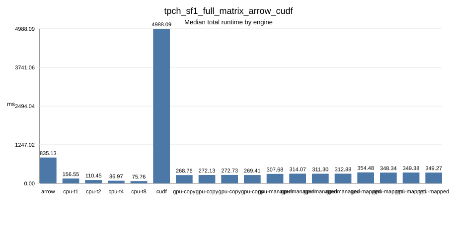
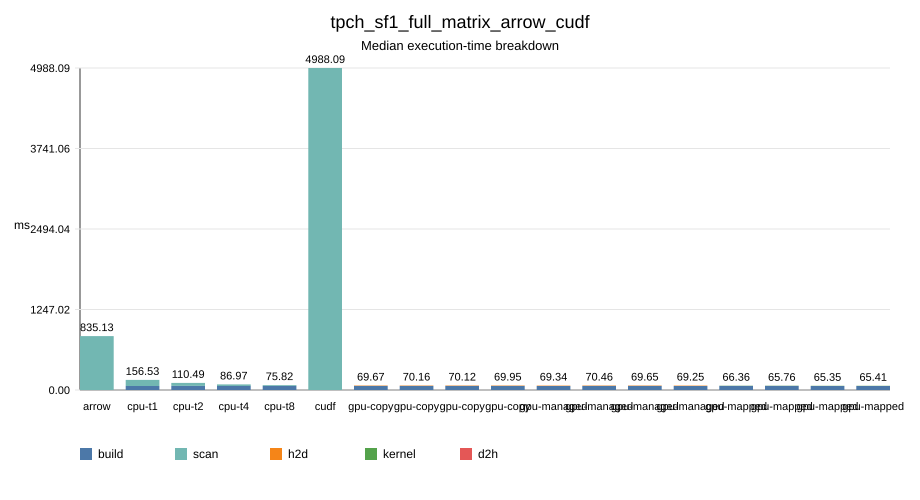

# TPC-H Q5 异构内存列式执行实验报告

## 摘要

本项目实现了一个面向 TPC-H Q5 的小型内存分析查询引擎。项目目标不是实现完整 SQL 数据库，而是围绕课程讨论中的核心问题展开：同一个多表分析查询在 CPU、手写 CUDA、显式 PCIe 传输、CUDA managed memory、mapped pinned host memory 以及 GPU 算子库执行方式下有什么差异。

当前版本包含列式数据加载、CPU 执行、三种 CUDA 内存模式、Python/PyArrow/DuckDB/cuDF 对照脚本、结果 hash 校验、批量 benchmark、环境采集和报告图表生成。GPU 运行时验证、官方 TPC-H SF1 实验以及 RAPIDS/cuDF SF1 对照实验已于 2026-07-01 在 NVIDIA GPU 服务器上完成；2026-07-08 又在同一类 GPU 服务器上补跑了官方 SF1 的 CPU/PyArrow/GPU/cuDF 完整同场对照矩阵。主要局限是实验规模只覆盖到官方 TPC-H SF1，未继续运行更大 scale factor。

## 1. 背景

分析型数据库查询通常包含大列扫描、选择过滤、多表连接和聚合，这类负载适合用来观察内存布局、CPU cache、NUMA、PCIe 传输、GPU 显存带宽和 kernel 执行效率。

TPC-H Q5（Local Supplier Volume）是一个典型多表查询。它连接 `region`、`nation`、`supplier`、`customer`、`orders` 和 `lineitem`，并按国家聚合收入。该查询足够固定，可以直接实现物理执行计划；同时又足够真实，可以体现维表过滤向事实表扫描传播的过程。

## 2. 需求复原

根据和老师讨论后的方案，本项目需要覆盖以下点：

- 实现 CPU 和 GPU 两条数据库查询执行路径。
- 比较 CPU 与 GPU 的执行行为。
- 比较手写 CUDA 与 NVIDIA/GPU 算子库风格的实现。
- 比较显式 PCIe 数据传输与 unified memory / UVA 风格访问。
- 以 TPC-H Q5 作为目标场景。
- 使用整数日期、bitmap/filter propagation 等面向数据库执行的表示。
- 说明小数据更适合 CPU、大数据可能更适合 GPU 的原因和边界。

因此，本项目实现的是 TPC-H Q5 的完整物理执行计划，而不是通用 SQL parser、optimizer、事务系统或完整 DBMS。

## 3. 数据布局

项目只加载 Q5 必需列：

| 表 | 列 |
|---|---|
| `region` | `r_regionkey`, `r_name` |
| `nation` | `n_nationkey`, `n_name`, `n_regionkey` |
| `supplier` | `s_suppkey`, `s_nationkey` |
| `customer` | `c_custkey`, `c_nationkey` |
| `orders` | `o_orderkey`, `o_custkey`, `o_orderdate` |
| `lineitem` | `l_orderkey`, `l_suppkey`, `l_extendedprice`, `l_discount` |

自定义列式存储采用连续定长数组、64 字节对齐分配、非拥有型 column view、可选 bitmap、整数日期编码、低基数字符串字典编码和 fixed-point revenue。这个实现保留了 Arrow 风格列式布局的关键思想，但没有重新实现完整 Arrow metadata、IPC 或 compute engine。

## 4. 查询计划

逻辑 SQL 等价于 TPC-H Q5：

```sql
select
  n_name,
  sum(l_extendedprice * (1 - l_discount)) as revenue
from customer, orders, lineitem, supplier, nation, region
where c_custkey = o_custkey
  and l_orderkey = o_orderkey
  and l_suppkey = s_suppkey
  and c_nationkey = s_nationkey
  and s_nationkey = n_nationkey
  and n_regionkey = r_regionkey
  and r_name = :region
  and o_orderdate >= :date
  and o_orderdate < :date + 1 year
group by n_name
order by revenue desc;
```

实际物理计划采用类似 star join 的 filter propagation：

1. 根据 region 名称找到 `region_key`。
2. 构造 `nation_in_region`。
3. 构造 `supplier_nation_by_key`。
4. 构造 `customer_nation_by_key`。
5. 对满足日期谓词的订单构造 `order_nation_by_key`。
6. 扫描 `lineitem`，检查 order/supplier nation 是否一致，并按 nation 聚合 revenue。

这样可以避免物化六表连接的大中间结果。

## 5. CPU 实现

CPU 路径负责构造 filter propagation map 并扫描 `lineitem`。程序支持 `--threads N` 参数，每个 worker 扫描一段 `lineitem` 并写入本地 revenue 数组，最后再归并为最终结果。这样 hot loop 中不需要原子更新。

主要文件：

- `src/engine/q5_plan.cpp`
- `src/cpu/q5_cpu.cpp`
- `src/common/*`
- `src/io/tpch_loader.cpp`

## 6. GPU 实现

项目实现了三种手写 CUDA 执行路径：

| 引擎 | 含义 |
|---|---|
| `gpu-copy` | 显式 `cudaMemcpy` H2D，执行 kernel，再 D2H 拷回结果 |
| `gpu-managed` | 使用 `cudaMallocManaged`，并通过 `cudaMemPrefetchAsync` 预取 |
| `gpu-mapped` | 使用 `cudaHostAllocMapped` 分配 pinned host memory，GPU 通过 device pointer 访问主机内存 |

三种路径当前复用 CPU 构造的 filter propagation map，并在 CUDA kernel 中执行 `lineitem` 聚合。这是一个正确的 GPU 里程碑；后续性能优化可以把更多 map 构造工作移动到 GPU，并减少聚合 kernel 中的 atomic 竞争。

主要文件：

- `src/cuda/q5_cuda.cu`
- `src/cuda/q5_cuda.hpp`
- `tests/test_q5_cuda.cpp`

## 7. 对照实现

项目包含四个对照脚本：

- `python_q5.py`：无第三方依赖的正确性参考。
- `arrow_q5.py`：基于 PyArrow CSV、Table join、group_by 和 compute 的 CPU 列式算子库对照。
- `duckdb_q5.py`：安装 DuckDB 后可运行的 SQL 对照。
- `cudf_q5.py`：安装 RAPIDS/cuDF 后可运行的 GPU DataFrame 对照。

其中 cuDF 是高层 GPU 算子库对照；手写 CUDA 是低层专用物理算子对照。

## 8. 实验环境

环境信息通过以下脚本记录：

```bash
python3 scripts/capture_environment.py --output results/environment.json
```

GPU 服务器验证在 2026-07-01 完成，使用 `CUDA_VISIBLE_DEVICES=0`，实际使用空闲的 RTX 4090，避免占用已经有任务的 L20。

| 项目 | 配置 |
|---|---|
| OS/kernel | Ubuntu Linux, kernel `6.17.0-29-generic` |
| CPU | 2 sockets, AMD EPYC 9654, 384 logical CPUs |
| GPU 列表 | 6 块 NVIDIA GeForce RTX 4090，2 块 NVIDIA L20 |
| 测试 GPU | GPU 0, NVIDIA GeForce RTX 4090, compute capability 8.9, 24 GiB |
| Driver / runtime | driver `595.71.05`, CUDA runtime `13.2` |
| `nvcc --version` | CUDA `12.6`, `V12.6.85` |
| CMake CUDA compiler | `/usr/bin/nvcc`, CUDA `12.0.140` |
| CMake | `4.3.0` |
| Python | `3.11.15` |
| PyArrow | default Python `24.0.0`；full matrix 使用的 `memq5-cudf` 环境为 `23.0.1` |
| RAPIDS cuDF | `26.06.00`, 位于 `memq5-cudf` conda 环境 |

CUDA 构建命令：

```bash
cmake -S . -B build-cuda \
  -DMEMQ5_ENABLE_CUDA=ON \
  -DMEMQ5_ENABLE_TESTS=ON \
  -DCMAKE_CUDA_ARCHITECTURES=89
cmake --build build-cuda
CUDA_VISIBLE_DEVICES=0 ctest --test-dir build-cuda --output-on-failure
```

`ctest` 共 6 个测试全部通过，`test_q5_cuda` 没有 skip，而是在真实 NVIDIA GPU 上运行并通过。

官方 TPC-H SF1 数据来自 `TPC-H V3.0.1` tools package。本地工具压缩包 `TPC-H-Tool.zip` 的 SHA256 为：

```text
97ccb34cd122d78c2e06e2419e50957f934256868b37c02d0b88aefd9d13a84a
```

`dbgen` 使用 `makefile.suite` 构建，参数为 `CC=gcc`、`DATABASE=ORACLE`、`MACHINE=LINUX`、`WORKLOAD=TPCH`，随后执行 `dbgen -vf -s 1` 生成 SF1 数据。

## 9. 实验结果

### 9.1 tiny 正确性实验

命令：

```bash
CUDA_VISIBLE_DEVICES=0 python3 scripts/run_experiment_pipeline.py \
  --name tiny_gpu_modes \
  --memq5 build-cuda/memq5 \
  --data-dir tests/fixtures/tpch_q5_tiny \
  --engines cpu,gpu-copy,gpu-managed,gpu-mapped,python \
  --repeat 5 \
  --force
```

hash 校验：

```text
ok ASIA 1994-01-01 hash=1e07d78fa8eededb engines=cpu,gpu-copy,gpu-managed,gpu-mapped,python
```

中位数结果：

| engine | threads | runs | hash | total_ms | scan_ms | h2d_ms | kernel_ms | d2h_ms | elapsed_ms |
|---|---:|---:|---|---:|---:|---:|---:|---:|---:|
| cpu | 1 | 5 | `1e07d78fa8eededb` | 0.012799 | 0.001673 | 0.000000 | 0.000000 | 0.000000 | 2.917052 |
| gpu-copy | 1 | 5 | `1e07d78fa8eededb` | 188.151000 | 0.171040 | 0.043008 | 0.108672 | 0.017664 | 256.674921 |
| gpu-managed | 1 | 5 | `1e07d78fa8eededb` | 188.922000 | 0.503456 | 0.117760 | 0.105472 | 0.266976 | 240.041216 |
| gpu-mapped | 1 | 5 | `1e07d78fa8eededb` | 187.576000 | 0.125920 | 0.007040 | 0.097984 | 0.022624 | 255.451920 |
| python | 1 | 5 | `1e07d78fa8eededb` | 0.230724 | 0.230724 | 0.000000 | 0.000000 | 0.000000 | 38.741158 |


说明：`threads` 是 benchmark driver 传给 C++ `memq5` 的参数，只控制 CPU engine 的 worker 数。当前 GPU kernel 固定使用 256-thread block，该列在 GPU 行中仅用于和 CPU sweep 的表结构对齐。

### 9.2 synthetic GPU 开发实验

该实验使用确定性生成的 Q5 形状数据，不是官方 TPC-H dbgen 数据，用于检查 GPU 运行时和内存模式趋势。

数据规模：

| 文件 | 行数 |
|---|---:|
| `region.tbl` | 5 |
| `nation.tbl` | 25 |
| `supplier.tbl` | 5,000 |
| `customer.tbl` | 10,000 |
| `orders.tbl` | 50,000 |
| `lineitem.tbl` | 200,000 |
| 1994 日期窗口订单 | 34,286 |

命令：

```bash
python3 scripts/generate_synthetic_tpch_q5.py \
  --output data/synthetic_gpu_dev \
  --customers 10000 \
  --orders 50000 \
  --lineitems 200000 \
  --suppliers 5000 \
  --asia-heavy

CUDA_VISIBLE_DEVICES=0 python3 scripts/run_experiment_pipeline.py \
  --name synthetic_gpu_modes \
  --memq5 build-cuda/memq5 \
  --data-dir data/synthetic_gpu_dev \
  --engines cpu,gpu-copy,gpu-managed,gpu-mapped,python \
  --thread-list 1,2,4,8 \
  --repeat 5 \
  --force
```

hash 校验：

```text
ok ASIA 1994-01-01 hash=d5ffe393223a207e engines=cpu,gpu-copy,gpu-managed,gpu-mapped,python
```

中位数摘要：

| engine | threads | total_ms | scan_ms | h2d_ms | kernel_ms | d2h_ms | hash |
|---|---:|---:|---:|---:|---:|---:|---|
| cpu | 1 | 5.282640 | 3.517350 | 0.000000 | 0.000000 | 0.000000 | `d5ffe393223a207e` |
| cpu | 2 | 3.919480 | 2.153160 | 0.000000 | 0.000000 | 0.000000 | `d5ffe393223a207e` |
| cpu | 4 | 3.092000 | 1.349080 | 0.000000 | 0.000000 | 0.000000 | `d5ffe393223a207e` |
| cpu | 8 | 2.970280 | 1.217070 | 0.000000 | 0.000000 | 0.000000 | `d5ffe393223a207e` |
| gpu-copy | 8 | 186.327000 | 0.518624 | 0.372736 | 0.126976 | 0.015840 | `d5ffe393223a207e` |
| gpu-managed | 8 | 187.830000 | 1.048380 | 0.833536 | 0.141216 | 0.063488 | `d5ffe393223a207e` |
| gpu-mapped | 8 | 195.000000 | 0.497344 | 0.007904 | 0.463872 | 0.023872 | `d5ffe393223a207e` |
| python | 1 | 477.305890 | 477.305890 | 0.000000 | 0.000000 | 0.000000 | `d5ffe393223a207e` |

完整 CSV 保存在实验结果目录；上表保留关键行用于报告分析。GPU 行中不同 `threads` 值不改变 CUDA launch 配置，只表示 benchmark 矩阵中的重复测量点。


### 9.3 官方 TPC-H SF1 实验

官方 SF1 数据通过 `dbgen -vf -s 1` 生成，并使用以下脚本整理为本项目读取格式：

```bash
python3 scripts/prepare_tpch_q5_data.py \
  --source-dir data/tpch_sf1_raw \
  --output-dir data/tpch_sf1 \
  --scale-factor 1 \
  --mode copy \
  --force
```

整理后的 Q5 数据规模：

| 文件 | 行数 |
|---|---:|
| `region.tbl` | 5 |
| `nation.tbl` | 25 |
| `supplier.tbl` | 10,000 |
| `customer.tbl` | 150,000 |
| `orders.tbl` | 1,500,000 |
| `lineitem.tbl` | 6,001,215 |
| 1994 日期窗口订单 | 227,597 |

命令：

```bash
CUDA_VISIBLE_DEVICES=0 python3 scripts/run_experiment_pipeline.py \
  --name tpch_sf1_gpu_modes \
  --memq5 build-cuda/memq5 \
  --data-dir data/tpch_sf1 \
  --engines cpu,gpu-copy,gpu-managed,gpu-mapped \
  --thread-list 1,2,4,8 \
  --repeat 5 \
  --force
```

hash 校验：

```text
ok ASIA 1994-01-01 hash=9f1f5f7578dd816e engines=cpu,gpu-copy,gpu-managed,gpu-mapped
```

CPU 8 线程输出结果：

| nation | revenue |
|---|---:|
| INDONESIA | 55502035.06 |
| VIETNAM | 55295080.65 |
| CHINA | 53724488.13 |
| INDIA | 52035506.17 |
| JAPAN | 45410170.55 |

中位数结果：

| engine | threads | total_ms | scan_ms | h2d_ms | kernel_ms | d2h_ms | hash |
|---|---:|---:|---:|---:|---:|---:|---|
| cpu | 1 | 157.107000 | 93.948400 | 0.000000 | 0.000000 | 0.000000 | `9f1f5f7578dd816e` |
| cpu | 2 | 109.855000 | 46.949500 | 0.000000 | 0.000000 | 0.000000 | `9f1f5f7578dd816e` |
| cpu | 4 | 87.155600 | 23.972400 | 0.000000 | 0.000000 | 0.000000 | `9f1f5f7578dd816e` |
| cpu | 8 | 76.211900 | 12.671300 | 0.000000 | 0.000000 | 0.000000 | `9f1f5f7578dd816e` |
| gpu-copy | 1 | 274.314000 | 6.752930 | 6.529280 | 0.197632 | 0.025888 | `9f1f5f7578dd816e` |
| gpu-copy | 2 | 275.848000 | 6.731900 | 6.495970 | 0.208896 | 0.026208 | `9f1f5f7578dd816e` |
| gpu-copy | 4 | 265.649000 | 6.786180 | 6.525950 | 0.232448 | 0.027776 | `9f1f5f7578dd816e` |
| gpu-copy | 8 | 267.698000 | 6.710850 | 6.478750 | 0.202752 | 0.027168 | `9f1f5f7578dd816e` |
| gpu-managed | 8 | 307.993000 | 6.576260 | 6.283390 | 0.193312 | 0.102400 | `9f1f5f7578dd816e` |
| gpu-mapped | 8 | 358.833000 | 2.731390 | 0.013280 | 2.681860 | 0.036032 | `9f1f5f7578dd816e` |


### 9.4 官方 TPC-H SF1 加 cuDF 对照

安装 RAPIDS cuDF 到单独的 `memq5-cudf` conda 环境后，重新运行官方 SF1 实验并加入 `cudf` baseline：

```bash
CUDA_VISIBLE_DEVICES=0 conda run -n memq5-cudf python \
  scripts/run_experiment_pipeline.py \
  --name tpch_sf1_with_cudf \
  --memq5 build-cuda/memq5 \
  --data-dir data/tpch_sf1 \
  --engines cpu,gpu-copy,gpu-managed,gpu-mapped,cudf \
  --thread-list 1,2,4,8 \
  --repeat 5 \
  --allow-benchmark-errors \
  --force
```

cuDF 先在 tiny fixture 上校验，输出 hash 与 CPU、手写 CUDA 和 Python 路径一致：

```text
result_hash,1e07d78fa8eededb
```

官方 SF1 hash 校验：

```text
ok ASIA 1994-01-01 hash=9f1f5f7578dd816e engines=cpu,gpu-copy,gpu-managed,gpu-mapped,cudf
```

cuDF 共生成 85 条成功 benchmark 行，错误行为 0。所有 CPU、手写 CUDA 和 cuDF 行都得到相同 result hash。

| engine | threads | total_ms | scan_ms | h2d_ms | kernel_ms | d2h_ms | hash |
|---|---:|---:|---:|---:|---:|---:|---|
| cpu | 8 | 75.372400 | 12.585000 | 0.000000 | 0.000000 | 0.000000 | `9f1f5f7578dd816e` |
| gpu-copy | 8 | 268.804000 | 6.769600 | 6.515580 | 0.204800 | 0.026976 | `9f1f5f7578dd816e` |
| gpu-managed | 8 | 309.007000 | 6.618240 | 6.295740 | 0.219104 | 0.103392 | `9f1f5f7578dd816e` |
| gpu-mapped | 8 | 352.668000 | 2.725440 | 0.015392 | 2.678500 | 0.035360 | `9f1f5f7578dd816e` |
| cudf | 1 | 4962.784182 | 4962.784182 | 0.000000 | 0.000000 | 0.000000 | `9f1f5f7578dd816e` |

对于 `cudf` 行，`threads=1` 只是共享 benchmark CSV schema 中的占位值。Python cuDF baseline 不接受 C++ 的 `--threads` 参数，RAPIDS/cuDF 内部自行调度 GPU 工作。这里的 `total_ms` 和 `scan_ms` 统计从读取 `.tbl` 文本、构造 cuDF DataFrame、执行 joins/groupby，到把最终小结果转回 pandas 的整体时间。


### 9.5 官方 TPC-H SF1 full matrix：CPU / PyArrow / GPU / cuDF 同场对照

为避免分批实验带来的环境和负载差异，2026-07-08 在 GPU 服务器上补跑了官方 SF1 的完整同场矩阵。该矩阵在同一次 pipeline 中包含：

- C++ `cpu`，线程数 `1,2,4,8`。
- PyArrow baseline `arrow`。
- 手写 CUDA `gpu-copy`、`gpu-managed`、`gpu-mapped`，线程字段保留为 `1,2,4,8` 以对齐 C++ benchmark schema。
- RAPIDS/cuDF baseline `cudf`。

默认 `python3` 环境可导入 PyArrow `24.0.0`，但没有安装 cuDF；因此正式 full matrix 使用同时包含 PyArrow `23.0.1` 和 cuDF `26.06.00` 的 `memq5-cudf` conda 环境运行：

```bash
CUDA_VISIBLE_DEVICES=0 conda run -n memq5-cudf python \
  scripts/run_experiment_pipeline.py \
  --name tpch_sf1_full_matrix_arrow_cudf \
  --memq5 build-cuda/memq5 \
  --data-dir data/tpch_sf1 \
  --engines cpu,arrow,gpu-copy,gpu-managed,gpu-mapped,cudf \
  --thread-list 1,2,4,8 \
  --repeat 5 \
  --force
```

数据验证结果：

```text
data_dir: data/tpch_sf1
region/date: ASIA 1994-01-01 to 1995-01-01
orders_in_date_window: 227597
ok: True
```

full matrix 共生成 90 条 benchmark 行，错误行为 0。所有成功 engine 的 result hash 一致：

```text
ok ASIA 1994-01-01 hash=9f1f5f7578dd816e engines=cpu,cpu,cpu,cpu,arrow,gpu-copy,gpu-copy,gpu-copy,gpu-copy,gpu-managed,gpu-managed,gpu-managed,gpu-managed,gpu-mapped,gpu-mapped,gpu-mapped,gpu-mapped,cudf,...
```

关键中位数如下：

| engine | threads | runs | hash | total_ms | scan_ms | h2d_ms | kernel_ms | d2h_ms | elapsed_ms |
|---|---:|---:|---|---:|---:|---:|---:|---:|---:|
| arrow | 1 | 5 | `9f1f5f7578dd816e` | 835.129574 | 835.129574 | 0.000000 | 0.000000 | 0.000000 | 1063.757308 |
| cpu | 1 | 5 | `9f1f5f7578dd816e` | 156.552000 | 93.833700 | 0.000000 | 0.000000 | 0.000000 | 16097.029193 |
| cpu | 2 | 5 | `9f1f5f7578dd816e` | 110.455000 | 46.974500 | 0.000000 | 0.000000 | 0.000000 | 15998.008189 |
| cpu | 4 | 5 | `9f1f5f7578dd816e` | 86.968800 | 24.193200 | 0.000000 | 0.000000 | 0.000000 | 15965.835117 |
| cpu | 8 | 5 | `9f1f5f7578dd816e` | 75.762500 | 12.515900 | 0.000000 | 0.000000 | 0.000000 | 15951.053500 |
| cudf | 1 | 5 | `9f1f5f7578dd816e` | 4988.085053 | 4988.085053 | 0.000000 | 0.000000 | 0.000000 | 5335.528074 |
| gpu-copy | 1 | 5 | `9f1f5f7578dd816e` | 268.757000 | 6.804290 | 6.539390 | 0.222208 | 0.027424 | 16247.941719 |
| gpu-copy | 2 | 5 | `9f1f5f7578dd816e` | 272.128000 | 6.789500 | 6.541540 | 0.232352 | 0.028544 | 16197.722001 |
| gpu-copy | 4 | 5 | `9f1f5f7578dd816e` | 272.733000 | 6.889570 | 6.627330 | 0.226560 | 0.027680 | 16225.192578 |
| gpu-copy | 8 | 5 | `9f1f5f7578dd816e` | 269.412000 | 6.854180 | 6.592420 | 0.233792 | 0.027584 | 16207.918594 |
| gpu-managed | 1 | 5 | `9f1f5f7578dd816e` | 307.684000 | 6.644770 | 6.343680 | 0.218112 | 0.102400 | 16255.393120 |
| gpu-managed | 2 | 5 | `9f1f5f7578dd816e` | 314.070000 | 6.612930 | 6.293700 | 0.218304 | 0.104192 | 16293.852519 |
| gpu-managed | 4 | 5 | `9f1f5f7578dd816e` | 311.295000 | 6.630590 | 6.315200 | 0.210944 | 0.102400 | 16377.836137 |
| gpu-managed | 8 | 5 | `9f1f5f7578dd816e` | 312.880000 | 6.596830 | 6.282430 | 0.217792 | 0.103424 | 16182.359227 |
| gpu-mapped | 1 | 5 | `9f1f5f7578dd816e` | 354.481000 | 2.773500 | 0.015392 | 2.711460 | 0.039392 | 16317.616274 |
| gpu-mapped | 2 | 5 | `9f1f5f7578dd816e` | 348.338000 | 2.764610 | 0.015360 | 2.710530 | 0.038752 | 16327.387187 |
| gpu-mapped | 4 | 5 | `9f1f5f7578dd816e` | 349.378000 | 2.764990 | 0.015520 | 2.711360 | 0.038240 | 16280.335783 |
| gpu-mapped | 8 | 5 | `9f1f5f7578dd816e` | 349.269000 | 2.773020 | 0.015360 | 2.710530 | 0.038432 | 16289.070718 |





## 10. 分析

GPU 服务器实验补齐了运行时正确性和官方数据两项关键缺口。`test_q5_cuda`、tiny fixture、synthetic 开发数据、官方 TPC-H SF1、cuDF SF1 对照以及 2026-07-08 的 CPU/PyArrow/GPU/cuDF full matrix 都在真实 NVIDIA GPU 服务器上运行成功。同一实验内所有成功的 CPU、GPU、Python、PyArrow 和 cuDF 路径均输出相同 result hash。

tiny 数据体现了小数据场景下 CPU 的优势。CPU 中位 `total_ms` 约 `0.013 ms`，而 GPU 总时间约 `188 ms`。即使 GPU kernel 自身约 `0.10 ms`，CUDA 上下文、启动和传输开销也已经远大于有效计算。

synthetic 数据有 200,000 行 `lineitem`，仍然表现出固定开销主导的问题。CPU 从 1 线程 `5.28 ms` 提升到 8 线程 `2.97 ms`；Python 参考实现为 `477.31 ms`，符合行式解释型实现的预期。手写 CUDA 的 kernel 与传输分量很小，但端到端总时间仍约 `186 ms` 到 `195 ms`。

官方 SF1 更能代表课程场景。CPU 从 1 线程 `157.11 ms` 提升到 8 线程 `76.21 ms`。`gpu-copy` 的 kernel 时间约 `0.20 ms`，显式 H2D 传输约 `6.5 ms`，说明 GPU 端事实表扫描本身很快。但是完整 `gpu-copy` 路径总时间仍为 `265.65 ms` 到 `275.85 ms`，在当前实现和 SF1 规模下没有超过多线程 CPU。主要原因是当前 GPU 路径仍在 CPU 上构造 Q5 filter propagation map，并且每次进程级查询都承担 CUDA setup、allocation 和 synchronization 开销。

PyArrow full matrix baseline 返回相同 result hash，中位 `total_ms` 约 `835.13 ms`。它比 dependency-free Python reference 更接近列式算子库实现，但仍慢于本项目专用 C++ CPU 路径。原因是 PyArrow baseline 每次从 `.tbl` 文本读取并使用通用 `Table.join` 和 `group_by` 算子执行完整多表计划，没有复用已加载列，也没有使用本项目针对 Q5 的 filter propagation map。

cuDF SF1 baseline 也返回相同 result hash，完成了高层 GPU 算子库对照。在当前 benchmark harness 中，cuDF 中位 `total_ms` 约 `4988.09 ms`，慢于优化后的 CPU 路径、PyArrow baseline 和手写 CUDA 路径。这个结果不应解释为 cuDF 的一般性能上限，而是说明本项目的 cuDF 脚本每次都从文本 `.tbl` 文件读取、构造 DataFrame、执行通用 joins/groupby，并把最终结果转回 pandas；它没有复用 GPU-resident 列，也没有专门针对 Q5 做物理计划优化。

三种 GPU 内存模式的部件级表现符合预期：

| 模式 | 观察 |
|---|---|
| `gpu-copy` | SF1 上显式 H2D 约 `6.5 ms`，kernel 约 `0.20 ms` |
| `gpu-managed` | 编程简单，但 SF1 总时间约 `307 ms`，慢于 `gpu-copy` |
| `gpu-mapped` | 几乎没有显式拷贝时间，但 kernel 约 `2.68 ms`，因为 GPU 通过主机互连访问 mapped host memory |

最终结论是：正确性已经闭合，性能结论是混合的。CUDA 实现有效展示了不同 GPU 内存模式的代价差异，但当前 CPU-prepared、per-invocation 的 GPU 路径在 SF1 上没有超过多线程 CPU。后续优化方向应是让数据跨查询常驻 GPU、复用 CUDA allocation，并把更多 filter propagation 工作移动到 GPU。

## 11. 完成清单

已完成：

- CPU engine。
- 多线程 CPU scan。
- TPC-H Q5 loader。
- tiny deterministic fixture。
- Python 正确性参考。
- PyArrow、DuckDB 和 cuDF baseline 脚本。
- CUDA `gpu-copy`、`gpu-managed`、`gpu-mapped` 编译和运行路径。
- 无 GPU 环境下可 skip 的 CUDA runtime test。
- 数据校验脚本。
- 环境采集脚本。
- benchmark runner。
- result hash verifier。
- summary 和 SVG 报告图表生成。
- 一键实验 pipeline。
- 本地 self-check。
- GPU 服务器环境验证，包括 `nvidia-smi`、`nvcc`、CMake 和 Python。
- RTX 4090-class architecture `89` 的 CUDA build。
- 真实 NVIDIA GPU 上的 CTest runtime validation。
- tiny CPU/GPU/Python hash 一致实验。
- synthetic CPU/GPU/Python hash 一致实验。
- 官方 TPC-H SF1 数据生成、数据校验、CPU/GPU benchmark matrix 和 hash `9f1f5f7578dd816e` 一致验证。
- RAPIDS/cuDF SF1 baseline 和 hash `9f1f5f7578dd816e` 一致验证。
- 官方 TPC-H SF1 CPU/PyArrow/GPU/cuDF full matrix，90 条 benchmark 行、0 个错误行，统一 hash `9f1f5f7578dd816e`。

仍存在的边界：

- 未运行大于 SF1 的官方 TPC-H scale factor。
- 构建目录、TPC-H 生成数据、raw results 和本地打包产物不纳入版本控制，可通过脚本和报告命令重新生成。

## 参考资料

- TPC-H specification。
- TPC current specifications page: `https://www.tpc.org/tpc_documents_current_versions/current_specifications5.asp`
- TPC-H tools download request page: `https://www.tpc.org/tpc_documents_current_versions/download_programs/tools-download-request5.asp?bm_type=TPC-H&bm_vers=3.0.1&mode=CURRENT-ONLY`
- Apache Arrow columnar format documentation。
- CUDA Programming Guide。
- RAPIDS cuDF documentation。
- DuckDB vectorized execution documentation。
- Crystal Opt GPU query implementation reference: `https://github.com/jiashenC/crystal-opt`
