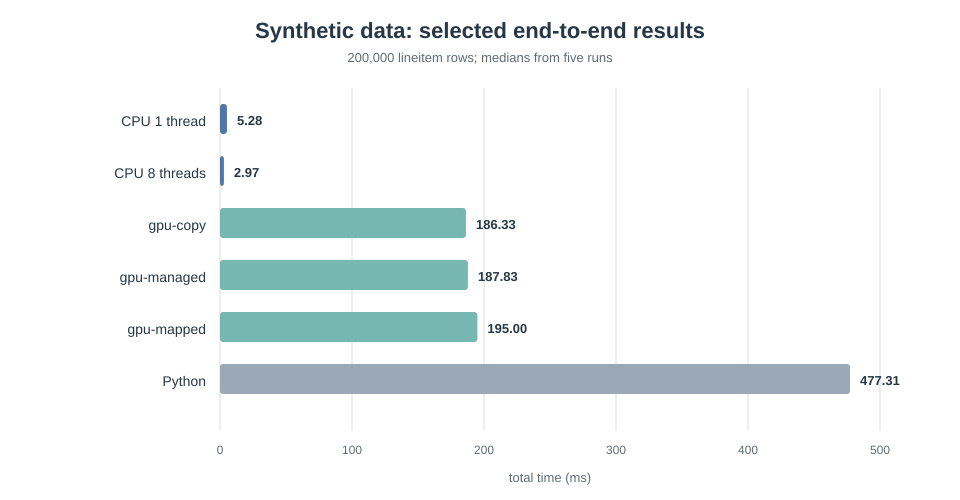
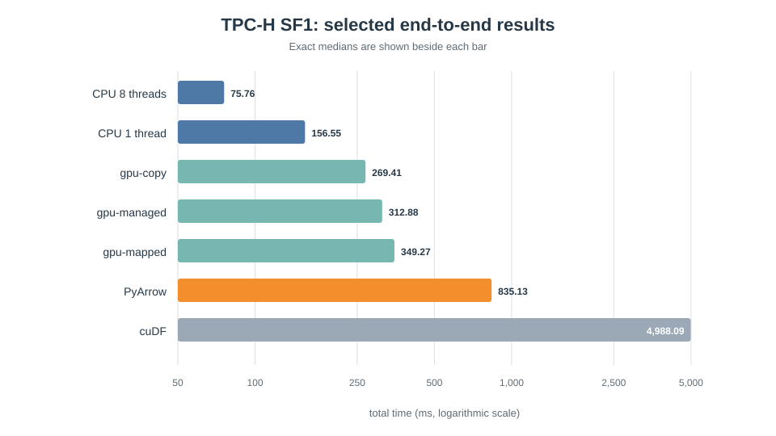
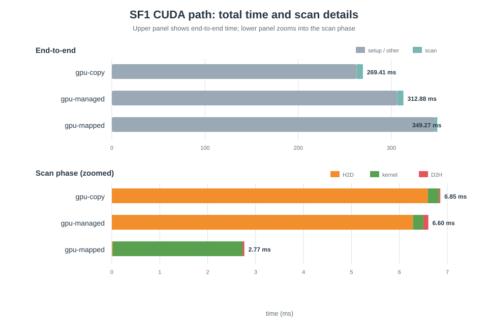

# TPC-H Q5 CPU/GPU 查询执行实验报告

> 数据库系统课程期末项目报告
>
> 报告时间：2026 年 7 月

## 摘要

本次课程项目围绕 TPC-H Q5 查询，实现并比较了 CPU、手写 CUDA 和通用算子库三类执行方式。我的目标不是从头实现一个完整数据库，而是把范围缩小到一条有代表性的分析查询，重点观察列式存储、过滤传播、多线程、PCIe 数据传输以及不同 GPU 内存模式对性能的影响。

项目实现了一个简单的列式数据加载器、一条专用的 Q5 物理执行计划、一个多线程 CPU 版本，以及 `gpu-copy`、`gpu-managed`、`gpu-mapped` 三种 CUDA 版本。为了检查结果是否可信，我还加入了 Python、PyArrow、DuckDB 和 cuDF 对照实现，并用 result hash 检查不同路径的输出是否一致。最终实验在 RTX 4090 服务器上完成，数据包括 tiny 测试集、20 万行 `lineitem` 的合成数据和官方 TPC-H SF1 数据。

实验结果和我最开始只看“GPU 算力”的直觉并不一样。在 SF1 上，8 线程 CPU 的中位执行时间为 `75.76 ms`，而三种手写 CUDA 路径的总时间约为 `269.41 ms`、`312.88 ms` 和 `349.27 ms`。不过，`gpu-copy` 的 kernel 本身只用了约 `0.23 ms`，说明 GPU 扫描很快，真正拖慢端到端时间的是数据准备、内存分配、传输和同步。这个结果让我认识到，数据库查询是否适合 GPU 不能只看 kernel 时间，还要看完整的数据路径以及数据能否常驻显存。

**关键词：** TPC-H Q5；列式存储；CUDA；GPU 内存；过滤传播；查询执行

## 1. 选题背景与项目目标

这次大作业的主题是内存数据库和异构硬件查询执行。课程讨论中涉及 Apache Arrow 的列式布局、CPU/GPU 执行、PCIe 传输、UVA、bitmap 过滤以及“小数据用 CPU、大数据用 GPU”等问题。为了把这些点放到同一个可以运行的例子中，我选择了 TPC-H Q5（Local Supplier Volume）作为目标查询。

Q5 会连接 `region`、`nation`、`supplier`、`customer`、`orders` 和 `lineitem` 六张表，包含日期过滤、多表连接、分组聚合和排序。它比单表扫描更接近真实分析查询，同时查询结构又是固定的，适合手写物理执行计划。

我把项目目标整理为四点：

1. 用连续的列式数组保存 Q5 需要的数据，避免在执行阶段反复处理整行记录。
2. 实现多线程 CPU 路径和三种 CUDA 内存路径，并保证它们返回相同结果。
3. 加入 PyArrow、DuckDB 和 cuDF 等通用实现作为对照，避免只比较自己写的代码。
4. 在真实 GPU 和官方 TPC-H 数据上做可复现实验，分析总时间，而不是只报告最短的 kernel 时间。

本报告只讨论仓库根目录的 TPC-H Q5/GPU 项目。仓库中的 `hashjoin-cpu/` 是课程前一阶段的 CPU hash join 实验，两部分在最终仓库中统一提交，但实现和实验数据是分开的。

## 2. 查询与总体方案

### 2.1 TPC-H Q5

Q5 的主要 SQL 逻辑如下。为了让实验参数可调整，代码中把区域和起始日期作为输入。

```sql
select
  n_name,
  sum(l_extendedprice * (1 - l_discount)) as revenue
from customer, orders, lineitem, supplier, nation, region
where c_custkey = o_custkey
  and l_orderkey = o_orderkey
  and l_suppkey = s_suppkey
  and c_nationkey = s_nationkey
  and s_nationkey = n_nationkey
  and n_regionkey = r_regionkey
  and r_name = :region
  and o_orderdate >= :date
  and o_orderdate < :date + interval '1' year
group by n_name
order by revenue desc;
```

如果直接物化六表连接，中间结果会很大。我的实现没有照着 SQL 顺序逐表 join，而是先把小表上的条件变成几个可以直接按 key 查询的数组，再扫描最大的 `lineitem` 表。这个思路和 star join 中的过滤传播比较接近。

### 2.2 物理执行计划

实际执行顺序如下：

1. 根据区域名称找到 `region_key`。
2. 标记属于该区域的 nation。
3. 构造 `supplier_nation_by_key` 和 `customer_nation_by_key`。
4. 对满足日期范围的订单构造 `order_nation_by_key`。
5. 扫描 `lineitem`，检查订单和供应商是否来自同一个目标 nation。
6. 按 nation 累加 revenue，最后再把 nation key 转回名称并排序。

这样做的好处是，扫描 `lineitem` 时主要进行数组访问、整数比较和整数加法，不需要在热点循环中处理字符串，也不需要保存完整连接结果。

### 2.3 数据表示

项目只读取 Q5 用到的列：

| 表 | 实际加载的列 |
|---|---|
| `region` | `r_regionkey`, `r_name` |
| `nation` | `n_nationkey`, `n_name`, `n_regionkey` |
| `supplier` | `s_suppkey`, `s_nationkey` |
| `customer` | `c_custkey`, `c_nationkey` |
| `orders` | `o_orderkey`, `o_custkey`, `o_orderdate` |
| `lineitem` | `l_orderkey`, `l_suppkey`, `l_extendedprice`, `l_discount` |

列数据使用连续定长数组和 64 字节对齐分配。日期在加载时转为整数天数；`region` 和 `nation` 名称只在输入、输出边界保留，执行阶段使用整数 key；revenue 使用 fixed-point 整数计算。这个实现借用了 Arrow 的关键思想，但没有尝试重做完整的 Arrow metadata、IPC 或通用计算框架。

## 3. CPU 与 GPU 实现

### 3.1 CPU 路径

CPU 版本先建立过滤传播数组，再把 `lineitem` 按区间分给多个 worker。每个线程使用自己的 revenue 数组，扫描结束后再统一归并。这样可以避免每条记录都进行原子加法。

CPU 路径支持 `--threads N`，本次实验测试了 1、2、4、8 线程。主要实现位于：

- `src/engine/q5_plan.cpp`
- `src/cpu/q5_cpu.cpp`
- `src/io/tpch_loader.cpp`

### 3.2 三种 CUDA 路径

三种 GPU 版本复用同一条 Q5 计划，但采用不同的数据访问方式：

| 模式 | 实现方式 | 我希望观察的问题 |
|---|---|---|
| `gpu-copy` | 通过 `cudaMemcpy` 把输入复制到 device memory，kernel 完成后再复制结果 | 显式传输的代价有多大 |
| `gpu-managed` | 使用 `cudaMallocManaged`，并在执行前后调用 prefetch | 统一内存是否能简化管理，以及是否有额外开销 |
| `gpu-mapped` | 使用 `cudaHostAllocMapped` 分配 pinned host memory，GPU 直接读取主机内存 | 省掉显式拷贝后，远程访问速度是否划算 |

当前 CUDA 版本仍由 CPU 构造过滤传播数组，GPU 负责扫描 `lineitem` 并聚合。它已经可以比较三种内存模式，但还不是“所有步骤都在 GPU 上完成”的最终优化版本。

### 3.3 对照实现

为了分别检查正确性和通用框架开销，仓库中保留了四个 baseline：

- `python_q5.py`：没有第三方依赖，主要用于看结果是否一致。
- `arrow_q5.py`：使用 PyArrow 的 CSV、Table join 和 group-by。
- `duckdb_q5.py`：直接执行 SQL，作为数据库实现参考。
- `cudf_q5.py`：使用 RAPIDS/cuDF 的 DataFrame join 和 group-by。

手写 C++/CUDA 代码针对 Q5 做了专门优化，而 PyArrow 和 cuDF 使用的是通用算子，所以两者不能被理解为完全公平的“库性能排名”。它们更适合帮助我理解专用物理计划和通用执行框架之间的差别。

## 4. 实现过程中遇到的问题

### 4.1 UVA、managed memory 和 mapped memory 容易混淆

刚开始整理方案时，UVA 和 unified memory 很容易被写成同一件事。查阅 CUDA 文档并实际实现后，我把实验拆成了三个明确模式：显式 device copy、managed memory，以及 mapped pinned host memory。这样每个模式的内存来源和访问路径都比较清楚，结果也更容易解释。

### 4.2 本地环境不能完成 GPU 运行验证

项目早期可以在本地完成 CPU 构建和 CUDA 编译检查，但没有可用的 NVIDIA 驱动，因此 CUDA runtime test 只能跳过。为了避免在上服务器之前才发现逻辑错误，我先做了 tiny fixture 和纯 Python 参考实现，并让所有引擎输出统一的 result hash。最后再到 GPU 服务器完成 CUDA CTest、合成数据和官方 SF1 实验。

### 4.3 浮点误差会干扰多实现校验

revenue 的计算包含价格和折扣。如果 CPU、CUDA、PyArrow 和 cuDF 都直接用浮点数累加，求和顺序不同可能带来末位误差。项目因此使用 fixed-point 整数保存和聚合金额。这样同一数据集上的结果可以直接生成 hash，不需要人为设置误差范围。

### 4.4 实验脚本比单次运行更重要

只运行一次程序很难保证结论可靠，所以我把数据检查、环境记录、重复 benchmark、hash 校验、汇总和绘图放进同一条 pipeline。每组实验重复 5 次，报告采用中位数。这个过程虽然比手动抄一组时间麻烦，但减少了漏记参数和选取偶然最优值的问题。

## 5. 实验环境与方法

GPU 实验在 2026 年 7 月完成，固定使用 `CUDA_VISIBLE_DEVICES=0` 的 RTX 4090。主要环境如下：

| 项目 | 配置 |
|---|---|
| 操作系统 | Ubuntu Linux，kernel `6.17.0-29-generic` |
| CPU | 2 路 AMD EPYC 9654，384 个逻辑 CPU |
| 测试 GPU | NVIDIA GeForce RTX 4090，24 GiB，compute capability 8.9 |
| NVIDIA driver / CUDA runtime | `595.71.05` / `13.2` |
| CUDA 编译器 | `nvcc 12.6`；CMake 实际识别 CUDA `12.0.140` |
| Python | `3.11.15` |
| PyArrow / cuDF | full matrix 环境为 PyArrow `23.0.1`、cuDF `26.06.00` |

官方 SF1 数据由 TPC-H V3.0.1 的 `dbgen -vf -s 1` 生成。三组数据的作用不同：

| 数据集 | `lineitem` 行数 | 用途 |
|---|---:|---|
| tiny fixture | 少量手工数据 | 快速检查结果和 CUDA 路径 |
| synthetic | 200,000 | 开发阶段观察线程和 GPU 模式趋势 |
| 官方 TPC-H SF1 | 6,001,215 | 最终对照实验 |

正式实验统一使用 `ASIA` 和 `1994-01-01` 到 `1995-01-01` 的日期窗口。所有成功运行的实现必须输出相同 hash，否则该组结果不进入性能分析。需要注意，GPU 行中的 `threads` 只是 benchmark CSV 为了统一格式保留的字段，不会改变 CUDA kernel 固定的 256-thread block 配置。

## 6. 实验结果

### 6.1 tiny 正确性实验

tiny 数据上，CPU、三种 CUDA 模式和 Python 都得到了相同 hash：

```text
1e07d78fa8eedb
```

| 引擎 | 中位 total_ms | 中位 kernel_ms | 观察 |
|---|---:|---:|---|
| CPU 1 线程 | 0.0128 | — | 数据太小，几乎没有调度成本 |
| `gpu-copy` | 188.1510 | 0.1087 | kernel 很短，但初始化和调用开销明显 |
| `gpu-managed` | 188.9220 | 0.1055 | 与 copy 模式接近 |
| `gpu-mapped` | 187.5760 | 0.0980 | 仍然被固定开销主导 |
| Python | 0.2307 | — | 作为正确性参考足够快 |


这个结果说明，小数据直接交给 GPU 并不划算。即使 kernel 只需要约 `0.1 ms`，一次完整 GPU 调用的固定成本仍然比实际计算大很多。

### 6.2 合成数据实验

合成数据包含 20 万行 `lineitem`。所有路径的 hash 都是 `d5ffe393223a207e`。关键结果如下：

| 引擎 | 中位 total_ms | 相比 CPU 1 线程的情况 |
|---|---:|---|
| CPU 1 线程 | 5.2826 | 基准 |
| CPU 8 线程 | 2.9703 | 有提升，但没有达到理想的 8 倍 |
| `gpu-copy` | 186.3270 | 固定 GPU 开销仍然占主导 |
| `gpu-managed` | 187.8300 | 与 copy 接近 |
| `gpu-mapped` | 195.0000 | mapped 访问没有带来总时间优势 |
| Python | 477.3059 | 行式解释执行明显较慢 |



从这组实验可以看到，数据量从 tiny 增长到 20 万行后，CPU 多线程已经有明显作用，但 GPU 总时间仍然基本停留在约 190 ms。这说明此时计算量还不足以摊薄每次进程级 GPU 执行的固定成本。

### 6.3 官方 TPC-H SF1 实验

SF1 中日期窗口内共有 227,597 条订单，最终聚合结果为：

| nation | revenue |
|---|---:|
| INDONESIA | 55,502,035.06 |
| VIETNAM | 55,295,080.65 |
| CHINA | 53,724,488.13 |
| INDIA | 52,035,506.17 |
| JAPAN | 45,410,170.55 |

CPU、PyArrow、三种手写 CUDA 和 cuDF 的结果 hash 均为 `9f1f5f7578dd816e`。full matrix 的关键中位数如下：

| 引擎 | 线程字段 | 中位 total_ms | 说明 |
|---|---:|---:|---|
| CPU | 1 | 156.5520 | 专用 C++ 物理计划 |
| CPU | 2 | 110.4550 | 继续受益于并行扫描 |
| CPU | 4 | 86.9688 | 加速开始变缓 |
| CPU | 8 | 75.7625 | 本次实验中最快的端到端路径 |
| PyArrow | 1 | 835.1296 | 文本读取 + 通用 joins/group-by |
| `gpu-copy` | 8 | 269.4120 | 三种 CUDA 模式中总时间最短 |
| `gpu-managed` | 8 | 312.8800 | 使用 managed memory 和 prefetch |
| `gpu-mapped` | 8 | 349.2690 | 无大块显式 H2D，但远程访问较慢 |
| cuDF | 1 | 4,988.0851 | 文本读取、建表、通用 joins/group-by、回传 pandas |



把三种 CUDA 路径拆开看，可以发现 kernel 和总时间之间差别很大：

| 模式 | scan_ms | h2d_ms | kernel_ms | d2h_ms | total_ms |
|---|---:|---:|---:|---:|---:|
| `gpu-copy` | 6.8542 | 6.5924 | 0.2338 | 0.0276 | 269.4120 |
| `gpu-managed` | 6.5968 | 6.2824 | 0.2178 | 0.1034 | 312.8800 |
| `gpu-mapped` | 2.7730 | 0.0154 | 2.7105 | 0.0384 | 349.2690 |



`gpu-copy` 的事实表 kernel 只有约 `0.23 ms`，显式 H2D 约 `6.59 ms`；`gpu-mapped` 几乎没有大块显式拷贝，但 kernel 增加到约 `2.71 ms`。这与 mapped host memory 需要通过主机互连读取数据的特点相符。

## 7. 结果分析

### 7.1 正确性比“最快时间”更先完成

本项目有多种语言和执行框架，如果没有统一校验，很容易出现某个版本速度很快但语义不一致的问题。tiny、synthetic 和 SF1 三组数据上，不同实现都分别得到一致 hash，说明日期范围、nation 条件、连接关系和 fixed-point revenue 的处理是统一的。我认为这是后续性能比较成立的前提。

### 7.2 当前规模下 CPU 更合适

tiny、synthetic 和 SF1 三组实验都没有出现手写 CUDA 总时间超过多线程 CPU 的情况。SF1 上 CPU 从 1 线程的 `156.55 ms` 降到 8 线程的 `75.76 ms`，说明这条专用计划在 CPU 上已经能较好地利用并行扫描。同时，SF1 只有约 600 万行 `lineitem`，还不足以抵消每次 GPU 查询的初始化、分配和同步成本。

### 7.3 GPU kernel 快不等于整条查询快

如果只报告 `gpu-copy` 的 `0.23 ms` kernel 时间，会得到“GPU 比 CPU 快几百倍”的错误印象。实际上，当前 GPU 路径还需要 CPU 先建立过滤传播数组，随后为一次查询准备 CUDA 内存、传输数据并同步。最终 `total_ms` 是 `269.41 ms`，比 8 线程 CPU 慢约 3.6 倍。

这也是本次实验最重要的结论：数据库算子是否适合 GPU，需要把数据准备、驻留位置和重复查询方式一起考虑。只有在数据已经在 GPU 上、allocation 可以复用，或者查询规模更大时，短 kernel 才可能真正转化为端到端优势。

### 7.4 三种内存模式各有代价

显式 copy 的代码稍复杂，但本次 SF1 上总时间最好。Managed memory 写起来更直接，不过迁移和同步并没有消失。Mapped memory 省掉了主要 H2D copy，却让 GPU 直接访问主机内存，kernel 变慢约一个数量级。因此，“少一次拷贝”不一定等于“总时间更短”。

### 7.5 PyArrow 和 cuDF 结果需要谨慎解释

PyArrow 和 cuDF 的 baseline 每次都从 `.tbl` 文本开始，构造通用表，再执行多个 join 和 group-by；手写 C++/CUDA 则只加载必需列，并使用针对 Q5 的过滤传播计划。cuDF 的 `4.99 s` 不能说明 cuDF 在所有场景都慢，只能说明当前脚本和当前数据路径的端到端成本较高。如果改成 Parquet、让数据长期保存在 GPU DataFrame 中，并重复执行多次查询，结果可能会明显不同。

## 8. 项目不足与改进方向

这次项目已经完成了可运行和可比较的目标，但仍有几个明显不足：

1. 官方实验只做到 SF1，没有继续测试 SF10 或更大数据，因此还没有找到 GPU 可能反超 CPU 的规模拐点。
2. 当前 GPU 路径仍由 CPU 建立过滤传播数组，没有把完整 Q5 计划放到 GPU 上。
3. 每次查询都会重新进行 CUDA setup 和内存分配，没有模拟数据库中“数据常驻、连续执行多条查询”的情况。
4. PyArrow 和 cuDF 从文本文件读取，I/O 与解析开销较大，与专用 C++ 路径并不完全对等。
5. 实现只支持 Q5，能够说明物理计划和硬件行为，但不能代表一个通用 SQL 数据库。

如果继续改进，我会优先做两件事：第一，把列数据和过滤数组常驻 GPU，并复用 allocation；第二，在 SF10 等更大数据上重复同一组实验。这样才能更准确地回答 GPU 在什么规模和什么使用方式下值得采用。

## 9. 总结与个人收获

通过这次项目，我完成了从列式数据加载、专用查询计划、多线程 CPU，到三种 CUDA 内存模式和通用框架 baseline 的一条完整实验链。最终结果没有简单证明“GPU 一定更快”，反而说明了一个更实际的问题：硬件峰值能力和数据库端到端性能之间还有数据布局、传输、初始化、同步和执行计划等很多环节。

我对课程中几个概念的理解也更具体了。列式存储不只是换一种文件格式，而是让热点循环只读取需要的列；过滤传播不只是画在查询计划图上的箭头，而是可以落实为直接索引数组；UVA、managed memory 和 mapped memory 也不能混在一起讨论，必须看实际的数据访问路径。对我来说，这些认识比得到一个“GPU 比 CPU 快多少倍”的单一数字更有价值。

## 10. 复现方法

CPU 构建与测试：

```bash
cmake -S . -B build \
  -DMEMQ5_ENABLE_CUDA=OFF \
  -DMEMQ5_ENABLE_TESTS=ON
cmake --build build
ctest --test-dir build --output-on-failure
```

RTX 4090 CUDA 构建与测试：

```bash
cmake -S . -B build-cuda \
  -DMEMQ5_ENABLE_CUDA=ON \
  -DMEMQ5_ENABLE_TESTS=ON \
  -DCMAKE_CUDA_ARCHITECTURES=89
cmake --build build-cuda
CUDA_VISIBLE_DEVICES=0 ctest --test-dir build-cuda --output-on-failure
```

官方 SF1 full matrix：

```bash
CUDA_VISIBLE_DEVICES=0 conda run -n memq5-cudf python \
  scripts/run_experiment_pipeline.py \
  --name tpch_sf1_full_matrix_arrow_cudf \
  --memq5 build-cuda/memq5 \
  --data-dir data/tpch_sf1 \
  --engines cpu,arrow,gpu-copy,gpu-managed,gpu-mapped,cudf \
  --thread-list 1,2,4,8 \
  --repeat 5 \
  --force
```

## 参考资料

1. TPC, *TPC Benchmark H Standard Specification, Revision 3.0.1*，`https://www.tpc.org/tpch/`。
2. Apache Arrow, *Columnar Format*，`https://arrow.apache.org/docs/format/Columnar.html`。
3. NVIDIA, *CUDA C++ Programming Guide*，`https://docs.nvidia.com/cuda/cuda-programming-guide/`。
4. RAPIDS, *cuDF Documentation*，`https://docs.rapids.ai/api/cudf/stable/`。
5. DuckDB, *Execution Format*，`https://duckdb.org/docs/stable/internals/vector`。
6. Crystal Opt GPU query implementation reference，`https://github.com/jiashenC/crystal-opt`。
