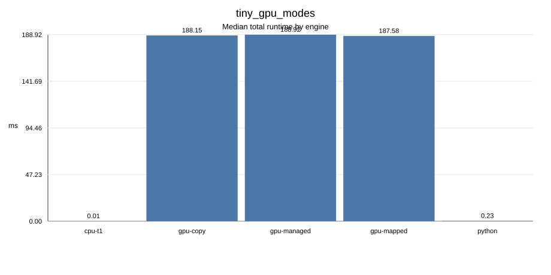
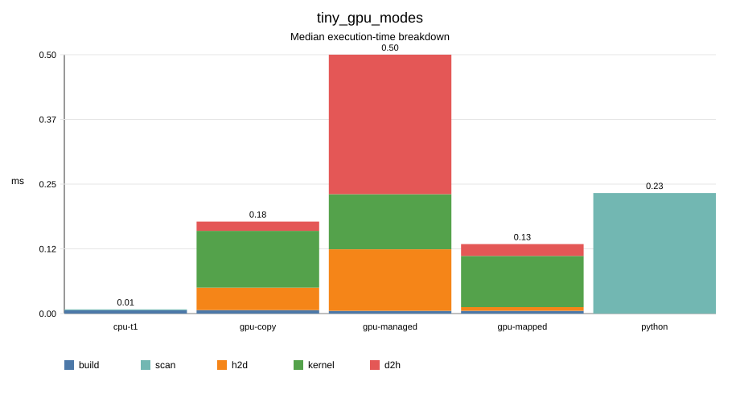
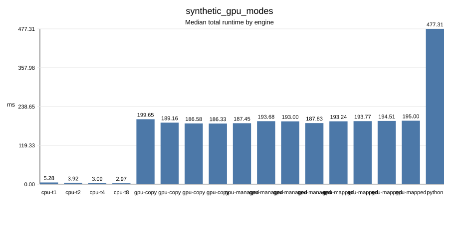
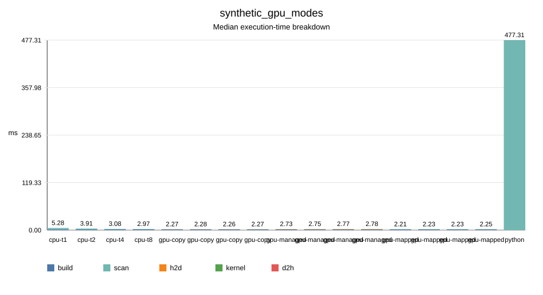
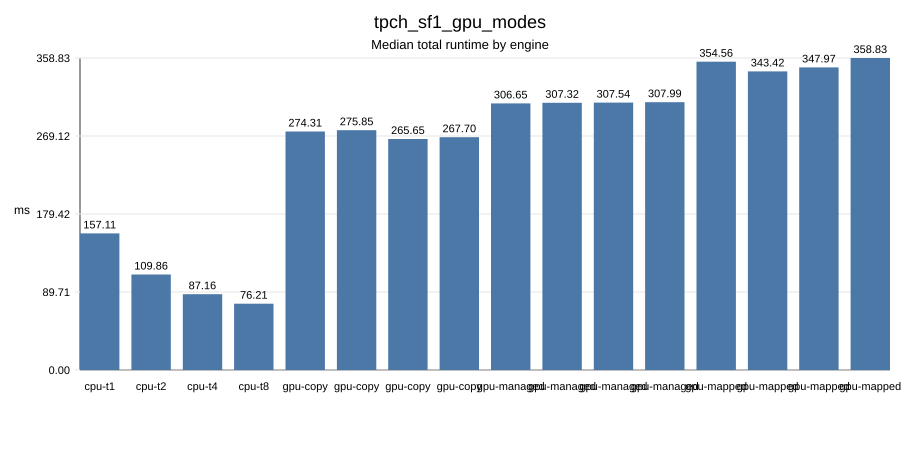
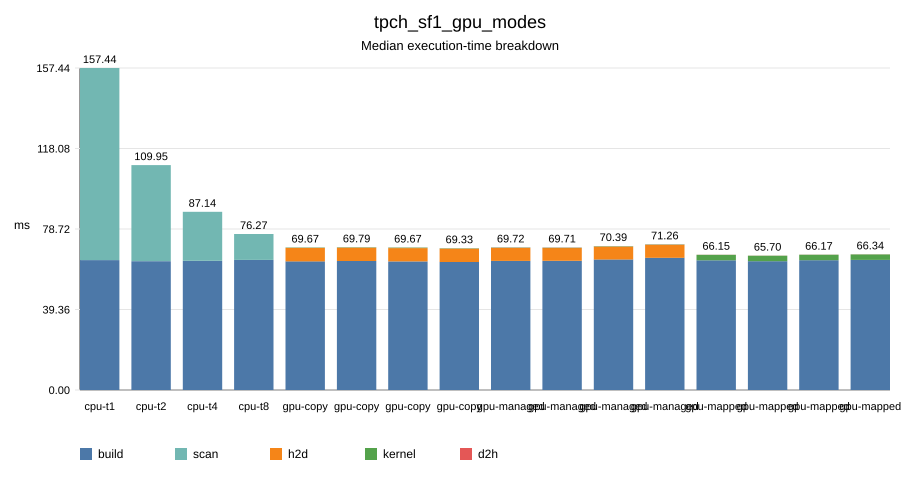
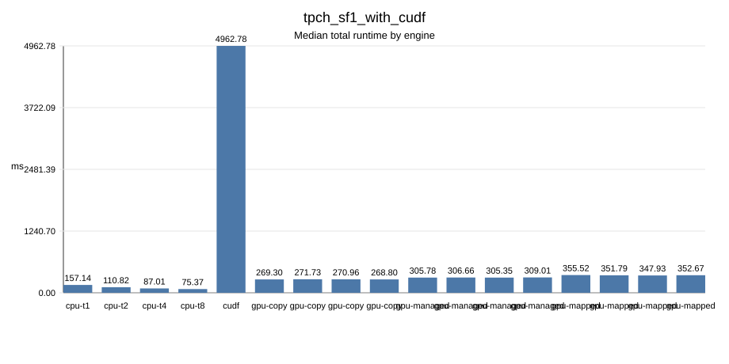
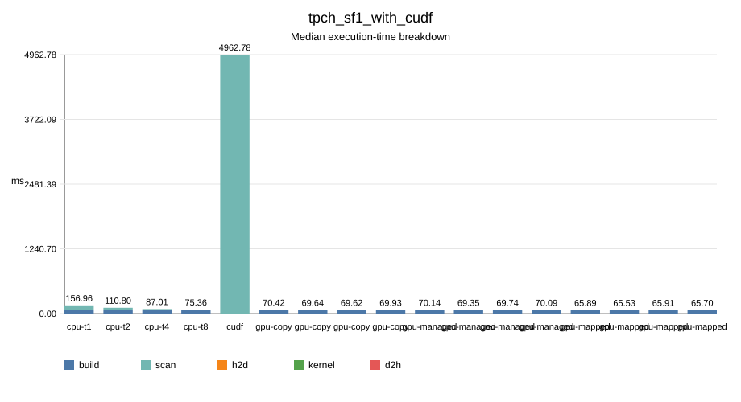

# TPC-H Q5 On A Heterogeneous In-Memory Column Store

## Abstract

This project implements a focused in-memory analytical query engine for TPC-H
Q5. The goal is not to build a full SQL DBMS, but to study the core execution
problem discussed in the course project: how a multi-table analytical database
query behaves under CPU execution, handwritten CUDA execution, explicit PCIe
transfer, CUDA managed memory, mapped pinned host memory, and GPU operator
library execution. The current implementation includes a CPU engine, three CUDA
memory-mode engines, correctness baselines, validation scripts, benchmark
automation, environment capture, and report asset generation. Local verification
passes all CPU and CUDA compile-only tests. GPU runtime validation, official
TPC-H SF1 experiments, and the RAPIDS/cuDF SF1 baseline were completed on an
NVIDIA GPU server on 2026-07-01. The main remaining limitation is scope: this
report uses SF1 and does not include larger TPC-H scale factors.

## 1. Background

Analytical database queries usually scan large columns, apply selective
predicates, join dimension tables with fact tables, and aggregate the result.
This makes them a good workload for studying memory layout, CPU cache behavior,
PCIe transfer overhead, GPU memory bandwidth, and GPU kernel efficiency.

TPC-H Q5, Local Supplier Volume, is a representative query because it joins
`region`, `nation`, `supplier`, `customer`, `orders`, and `lineitem`, then
aggregates revenue by nation. The query is fixed enough to implement directly,
but still realistic enough to exercise multi-table filter propagation and large
fact-table scanning.

## 2. Requirement Reconstruction

The original teacher discussion emphasized the following requirements:

- implement CPU and GPU database query paths,
- compare CPU and GPU behavior,
- compare handwritten CUDA with NVIDIA/GPU operator-library style execution,
- compare explicit PCIe data movement with unified-memory or UVA-style access,
- use TPC-H Q5 as the target scenario,
- use integer date representation and bitmap/filter-style propagation,
- treat small data as CPU-friendly and large data as GPU-friendly.

The project therefore implements one complete physical plan for TPC-H Q5 rather
than a general parser, optimizer, transaction manager, or full SQL engine.

## 3. Data Layout

Only Q5-required columns are loaded:

- `region`: `r_regionkey`, `r_name`
- `nation`: `n_nationkey`, `n_name`, `n_regionkey`
- `supplier`: `s_suppkey`, `s_nationkey`
- `customer`: `c_custkey`, `c_nationkey`
- `orders`: `o_orderkey`, `o_custkey`, `o_orderdate`
- `lineitem`: `l_orderkey`, `l_suppkey`, `l_extendedprice`, `l_discount`

The custom column store uses contiguous fixed-width buffers, 64-byte aligned
allocation, non-owning column views, optional bitmap support, integer date
encoding, string dictionary encoding for low-cardinality names, and fixed-point
integer revenue. This follows the important Arrow-style layout idea without
reimplementing the full Arrow format, IPC metadata, or compute engine.

## 4. Query Plan

The logical SQL is equivalent to TPC-H Q5:

```sql
select
  n_name,
  sum(l_extendedprice * (1 - l_discount)) as revenue
from customer, orders, lineitem, supplier, nation, region
where c_custkey = o_custkey
  and l_orderkey = o_orderkey
  and l_suppkey = s_suppkey
  and c_nationkey = s_nationkey
  and s_nationkey = n_nationkey
  and n_regionkey = r_regionkey
  and r_name = :region
  and o_orderdate >= :date
  and o_orderdate < :date + 1 year
group by n_name
order by revenue desc;
```

The physical plan is a star-join-like filter-propagation pipeline:

1. Find `region_key` from the selected region name.
2. Build `nation_in_region`.
3. Build `supplier_nation_by_key`.
4. Build `customer_nation_by_key`.
5. Build `order_nation_by_key` with the date predicate.
6. Scan `lineitem`, check order/supplier nation equality, and aggregate revenue
   by nation.

This avoids materializing large intermediate six-table join results.

## 5. CPU Implementation

The CPU implementation builds the filter-propagation maps and scans `lineitem`.
It supports `--threads N`. Each worker scans a slice of `lineitem` into a local
revenue array, then the local arrays are reduced into the final result. This
keeps the hot loop simple and avoids atomic updates in the CPU path.

Implemented files:

- `src/engine/q5_plan.cpp`
- `src/cpu/q5_cpu.cpp`
- `src/common/*`
- `src/io/tpch_loader.cpp`

## 6. GPU Implementation

Three handwritten CUDA execution paths are implemented:

- `gpu-copy`: explicit host-to-device copies with `cudaMemcpy`, kernel execution,
  and device-to-host result copy.
- `gpu-managed`: `cudaMallocManaged` buffers with `cudaMemPrefetchAsync`.
- `gpu-mapped`: mapped pinned host buffers created with `cudaHostAllocMapped`,
  accessed by the GPU through device pointers.

All three paths currently reuse the CPU-built filter-propagation maps and run a
CUDA `lineitem` aggregation kernel. This is a correct first GPU milestone. A
later optimization step can move more map construction work to the GPU and
reduce atomic contention in the aggregation kernel.

Implemented files:

- `src/cuda/q5_cuda.cu`
- `src/cuda/q5_cuda.hpp`
- `tests/test_q5_cuda.cpp`

## 7. Baselines

Implemented baselines:

- `python_q5.py`: dependency-free correctness reference.
- `duckdb_q5.py`: SQL baseline when DuckDB is installed.
- `cudf_q5.py`: RAPIDS cuDF baseline when a RAPIDS GPU environment is available.

The cuDF baseline is the main high-level NVIDIA/GPU operator-library comparison
path. The handwritten CUDA implementation is the low-level path.

## 8. Experimental Setup

The project records environment metadata with:

```bash
python3 scripts/capture_environment.py --output results/environment.json
```

GPU server validation was run on 2026-07-01 with `CUDA_VISIBLE_DEVICES=0` so
that the experiments used an idle RTX 4090 instead of the L20 devices that were
already occupied by another process.

Environment summary:

- OS/kernel: Ubuntu Linux, kernel `6.17.0-29-generic`.
- CPU: 2 sockets, AMD EPYC 9654, 384 logical CPUs.
- GPU inventory: six NVIDIA GeForce RTX 4090 GPUs and two NVIDIA L20 GPUs.
- Test GPU: GPU 0, NVIDIA GeForce RTX 4090, compute capability 8.9,
  24 GiB device memory.
- Driver/runtime from `nvidia-smi`: driver `595.71.05`, CUDA runtime `13.2`.
- `nvcc --version` on `PATH`: CUDA `12.6`, `V12.6.85`.
- CMake CUDA compiler selected by configure: `/usr/bin/nvcc`, CUDA `12.0.140`.
- CMake: `4.3.0`.
- Python: `3.11.15`.
- RAPIDS cuDF: `26.06.00` in the `memq5-cudf` conda environment
  (`/home/xuzihuan/miniconda3/envs/memq5-cudf/bin/python`).

The CUDA build used:

```bash
cmake -S . -B build-cuda \
  -DMEMQ5_ENABLE_CUDA=ON \
  -DMEMQ5_ENABLE_TESTS=ON \
  -DCMAKE_CUDA_ARCHITECTURES=89
cmake --build build-cuda
CUDA_VISIBLE_DEVICES=0 ctest --test-dir build-cuda --output-on-failure
```

`ctest` passed all six tests. The CUDA test did not skip: `test_q5_cuda` ran and
passed on the server GPU.

Official TPC-H SF1 data was generated from the downloaded `TPC-H V3.0.1` tools
package. The local zip was `TPC-H-Tool.zip` with SHA256
`97ccb34cd122d78c2e06e2419e50957f934256868b37c02d0b88aefd9d13a84a`.
`dbgen` was built from `makefile.suite` with `CC=gcc`, `DATABASE=ORACLE`,
`MACHINE=LINUX`, and `WORKLOAD=TPCH`, then run at scale factor 1.

## 9. Measured Results

### 9.1 Tiny GPU Correctness Fixture

Command:

```bash
CUDA_VISIBLE_DEVICES=0 python3 scripts/run_experiment_pipeline.py \
  --name tiny_gpu_modes \
  --memq5 build-cuda/memq5 \
  --data-dir tests/fixtures/tpch_q5_tiny \
  --engines cpu,gpu-copy,gpu-managed,gpu-mapped,python \
  --repeat 5 \
  --force
```

Hash check:

```text
ok ASIA 1994-01-01 hash=1e07d78fa8eededb engines=cpu,gpu-copy,gpu-managed,gpu-mapped,python
```

Median timing table:

The `threads` column is the `--threads` value passed by the benchmark driver to
the C++ `memq5` executable. It controls CPU worker count for the `cpu` engine.
For the current GPU engines, the CUDA kernel uses a fixed 256-thread block size
and does not use this CLI value; GPU rows with different `threads` values in a
thread-list sweep are retained only so the C++ benchmark matrix lines up with
the CPU sweep.

| engine | threads | runs | hash | total_ms_median | scan_ms_median | h2d_ms_median | kernel_ms_median | d2h_ms_median | elapsed_ms_median |
| --- | --- | --- | --- | ---: | ---: | ---: | ---: | ---: | ---: |
| cpu | 1 | 5 | `1e07d78fa8eededb` | 0.012799 | 0.001673 | 0.000000 | 0.000000 | 0.000000 | 2.917052 |
| gpu-copy | 1 | 5 | `1e07d78fa8eededb` | 188.151000 | 0.171040 | 0.043008 | 0.108672 | 0.017664 | 256.674921 |
| gpu-managed | 1 | 5 | `1e07d78fa8eededb` | 188.922000 | 0.503456 | 0.117760 | 0.105472 | 0.266976 | 240.041216 |
| gpu-mapped | 1 | 5 | `1e07d78fa8eededb` | 187.576000 | 0.125920 | 0.007040 | 0.097984 | 0.022624 | 255.451920 |
| python | 1 | 5 | `1e07d78fa8eededb` | 0.230724 | 0.230724 | 0.000000 | 0.000000 | 0.000000 | 38.741158 |

Figures:





### 9.2 Synthetic GPU Development Experiment

This experiment uses deterministic generated Q5-shaped data, not official TPC-H
dbgen data. It is useful for GPU runtime and memory-mode trend checks only.

Data size:

- `region.tbl`: 5 rows
- `nation.tbl`: 25 rows
- `supplier.tbl`: 5,000 rows
- `customer.tbl`: 10,000 rows
- `orders.tbl`: 50,000 rows
- `lineitem.tbl`: 200,000 rows
- orders in the `1994-01-01` to `1995-01-01` date window: 34,286

Command:

```bash
python3 scripts/generate_synthetic_tpch_q5.py \
  --output data/synthetic_gpu_dev \
  --customers 10000 \
  --orders 50000 \
  --lineitems 200000 \
  --suppliers 5000 \
  --asia-heavy

CUDA_VISIBLE_DEVICES=0 python3 scripts/run_experiment_pipeline.py \
  --name synthetic_gpu_modes \
  --memq5 build-cuda/memq5 \
  --data-dir data/synthetic_gpu_dev \
  --engines cpu,gpu-copy,gpu-managed,gpu-mapped,python \
  --thread-list 1,2,4,8 \
  --repeat 5 \
  --force
```

Hash check:

```text
ok ASIA 1994-01-01 hash=d5ffe393223a207e engines=cpu,gpu-copy,gpu-managed,gpu-mapped,python
```

Median timing table:

The `threads` column has the same meaning as in the tiny experiment: it is a
C++ benchmark-driver parameter, not a CUDA launch-configuration field. Only the
CPU engine uses it to change host worker count. The GPU implementations build
the CPU-side Q5 filter maps once per process invocation and launch a fixed
CUDA kernel configuration, so the GPU `threads=1,2,4,8` rows should be read as
repeat measurements under the same GPU execution policy.

| engine | threads | runs | hash | total_ms_median | scan_ms_median | h2d_ms_median | kernel_ms_median | d2h_ms_median | elapsed_ms_median |
| --- | --- | --- | --- | ---: | ---: | ---: | ---: | ---: | ---: |
| cpu | 1 | 5 | `d5ffe393223a207e` | 5.282640 | 3.517350 | 0.000000 | 0.000000 | 0.000000 | 536.606586 |
| cpu | 2 | 5 | `d5ffe393223a207e` | 3.919480 | 2.153160 | 0.000000 | 0.000000 | 0.000000 | 536.685224 |
| cpu | 4 | 5 | `d5ffe393223a207e` | 3.092000 | 1.349080 | 0.000000 | 0.000000 | 0.000000 | 537.803456 |
| cpu | 8 | 5 | `d5ffe393223a207e` | 2.970280 | 1.217070 | 0.000000 | 0.000000 | 0.000000 | 538.073060 |
| gpu-copy | 1 | 5 | `d5ffe393223a207e` | 199.650000 | 0.521152 | 0.378944 | 0.122880 | 0.015712 | 796.141558 |
| gpu-copy | 2 | 5 | `d5ffe393223a207e` | 189.160000 | 0.523936 | 0.371712 | 0.131808 | 0.016384 | 787.868087 |
| gpu-copy | 4 | 5 | `d5ffe393223a207e` | 186.583000 | 0.516800 | 0.374080 | 0.126976 | 0.015744 | 794.882644 |
| gpu-copy | 8 | 5 | `d5ffe393223a207e` | 186.327000 | 0.518624 | 0.372736 | 0.126976 | 0.015840 | 788.315773 |
| gpu-managed | 1 | 5 | `d5ffe393223a207e` | 187.450000 | 0.998400 | 0.799744 | 0.129024 | 0.066560 | 788.664830 |
| gpu-managed | 2 | 5 | `d5ffe393223a207e` | 193.684000 | 1.000450 | 0.814080 | 0.129280 | 0.056224 | 786.843560 |
| gpu-managed | 4 | 5 | `d5ffe393223a207e` | 193.003000 | 1.010620 | 0.827072 | 0.137216 | 0.056320 | 784.143603 |
| gpu-managed | 8 | 5 | `d5ffe393223a207e` | 187.830000 | 1.048380 | 0.833536 | 0.141216 | 0.063488 | 788.378766 |
| gpu-mapped | 1 | 5 | `d5ffe393223a207e` | 193.243000 | 0.469728 | 0.006144 | 0.442368 | 0.022592 | 794.352286 |
| gpu-mapped | 2 | 5 | `d5ffe393223a207e` | 193.769000 | 0.470560 | 0.008192 | 0.444416 | 0.020864 | 796.128510 |
| gpu-mapped | 4 | 5 | `d5ffe393223a207e` | 194.512000 | 0.481696 | 0.006144 | 0.455424 | 0.022400 | 796.462307 |
| gpu-mapped | 8 | 5 | `d5ffe393223a207e` | 195.000000 | 0.497344 | 0.007904 | 0.463872 | 0.023872 | 796.575033 |
| python | 1 | 5 | `d5ffe393223a207e` | 477.305890 | 477.305890 | 0.000000 | 0.000000 | 0.000000 | 516.687679 |

Figures:





### 9.3 Official TPC-H SF1 Experiment

Official SF1 data was generated with `dbgen -vf -s 1` and prepared with:

```bash
python3 scripts/prepare_tpch_q5_data.py \
  --source-dir data/tpch_sf1_raw \
  --output-dir data/tpch_sf1 \
  --scale-factor 1 \
  --mode copy \
  --force
```

Prepared Q5 data size:

- `region.tbl`: 5 rows
- `nation.tbl`: 25 rows
- `supplier.tbl`: 10,000 rows
- `customer.tbl`: 150,000 rows
- `orders.tbl`: 1,500,000 rows
- `lineitem.tbl`: 6,001,215 rows
- orders in the `1994-01-01` to `1995-01-01` date window: 227,597

Command:

```bash
CUDA_VISIBLE_DEVICES=0 python3 scripts/run_experiment_pipeline.py \
  --name tpch_sf1_gpu_modes \
  --memq5 build-cuda/memq5 \
  --data-dir data/tpch_sf1 \
  --engines cpu,gpu-copy,gpu-managed,gpu-mapped \
  --thread-list 1,2,4,8 \
  --repeat 5 \
  --force
```

Hash check:

```text
ok ASIA 1994-01-01 hash=9f1f5f7578dd816e engines=cpu,gpu-copy,gpu-managed,gpu-mapped
```

Result rows from the CPU 8-thread run:

| nation | revenue |
| --- | ---: |
| INDONESIA | 55502035.06 |
| VIETNAM | 55295080.65 |
| CHINA | 53724488.13 |
| INDIA | 52035506.17 |
| JAPAN | 45410170.55 |

Median timing table:

The `threads` column is the same benchmark-driver field described above. The
CPU rows use it as worker count. GPU rows keep the same field for matrix
alignment; the CUDA launch uses a fixed kernel configuration.

| engine | threads | runs | hash | total_ms_median | scan_ms_median | h2d_ms_median | kernel_ms_median | d2h_ms_median | elapsed_ms_median |
| --- | --- | --- | --- | ---: | ---: | ---: | ---: | ---: | ---: |
| cpu | 1 | 5 | `9f1f5f7578dd816e` | 157.107000 | 93.948400 | 0.000000 | 0.000000 | 0.000000 | 16063.048854 |
| cpu | 2 | 5 | `9f1f5f7578dd816e` | 109.855000 | 46.949500 | 0.000000 | 0.000000 | 0.000000 | 16060.163192 |
| cpu | 4 | 5 | `9f1f5f7578dd816e` | 87.155600 | 23.972400 | 0.000000 | 0.000000 | 0.000000 | 16020.153216 |
| cpu | 8 | 5 | `9f1f5f7578dd816e` | 76.211900 | 12.671300 | 0.000000 | 0.000000 | 0.000000 | 16031.832139 |
| gpu-copy | 1 | 5 | `9f1f5f7578dd816e` | 274.314000 | 6.752930 | 6.529280 | 0.197632 | 0.025888 | 16269.571092 |
| gpu-copy | 2 | 5 | `9f1f5f7578dd816e` | 275.848000 | 6.731900 | 6.495970 | 0.208896 | 0.026208 | 16251.653590 |
| gpu-copy | 4 | 5 | `9f1f5f7578dd816e` | 265.649000 | 6.786180 | 6.525950 | 0.232448 | 0.027776 | 16226.326749 |
| gpu-copy | 8 | 5 | `9f1f5f7578dd816e` | 267.698000 | 6.710850 | 6.478750 | 0.202752 | 0.027168 | 16253.359118 |
| gpu-managed | 1 | 5 | `9f1f5f7578dd816e` | 306.651000 | 6.659070 | 6.326080 | 0.202752 | 0.093184 | 16302.204770 |
| gpu-managed | 2 | 5 | `9f1f5f7578dd816e` | 307.321000 | 6.566020 | 6.248580 | 0.191488 | 0.111616 | 16289.880895 |
| gpu-managed | 4 | 5 | `9f1f5f7578dd816e` | 307.536000 | 6.593860 | 6.290590 | 0.193408 | 0.065536 | 16354.956034 |
| gpu-managed | 8 | 5 | `9f1f5f7578dd816e` | 307.993000 | 6.576260 | 6.283390 | 0.193312 | 0.102400 | 16353.421533 |
| gpu-mapped | 1 | 5 | `9f1f5f7578dd816e` | 354.555000 | 2.722850 | 0.012288 | 2.673540 | 0.035904 | 16421.531540 |
| gpu-mapped | 2 | 5 | `9f1f5f7578dd816e` | 343.415000 | 2.737820 | 0.013632 | 2.685730 | 0.033536 | 16418.682619 |
| gpu-mapped | 4 | 5 | `9f1f5f7578dd816e` | 347.973000 | 2.727140 | 0.012256 | 2.673660 | 0.037152 | 16361.069568 |
| gpu-mapped | 8 | 5 | `9f1f5f7578dd816e` | 358.833000 | 2.731390 | 0.013280 | 2.681860 | 0.036032 | 16401.672345 |

Figures:





### 9.4 Official TPC-H SF1 With cuDF Baseline

After installing RAPIDS cuDF into a separate `memq5-cudf` conda environment,
the official SF1 experiment was rerun with the `cudf` baseline included:

```bash
CUDA_VISIBLE_DEVICES=0 conda run -n memq5-cudf python \
  scripts/run_experiment_pipeline.py \
  --name tpch_sf1_with_cudf \
  --memq5 build-cuda/memq5 \
  --data-dir data/tpch_sf1 \
  --engines cpu,gpu-copy,gpu-managed,gpu-mapped,cudf \
  --thread-list 1,2,4,8 \
  --repeat 5 \
  --allow-benchmark-errors \
  --force
```

The cuDF baseline was first checked on the tiny fixture and produced the same
hash as the CPU, handwritten CUDA, and Python paths:

```text
result_hash,1e07d78fa8eededb
```

Official SF1 hash check:

```text
ok ASIA 1994-01-01 hash=9f1f5f7578dd816e engines=cpu,gpu-copy,gpu-managed,gpu-mapped,cudf
```

The cuDF run produced 85 successful benchmark rows and 0 error rows. All CPU,
handwritten CUDA, and cuDF rows produced the same result hash.

For the `cudf` row, `threads=1` is a placeholder written by the shared benchmark
CSV schema. The Python cuDF baseline does not accept the C++ `--threads`
parameter; RAPIDS/cuDF schedules its own GPU work internally. The cuDF
`total_ms` and `scan_ms` values time the Python baseline from `.tbl` file reads
through cuDF joins, aggregation, and result transfer back to pandas.

| engine | threads | runs | hash | total_ms_median | scan_ms_median | h2d_ms_median | kernel_ms_median | d2h_ms_median | elapsed_ms_median |
| --- | --- | --- | --- | ---: | ---: | ---: | ---: | ---: | ---: |
| cpu | 1 | 5 | `9f1f5f7578dd816e` | 157.144000 | 93.583000 | 0.000000 | 0.000000 | 0.000000 | 16056.151655 |
| cpu | 2 | 5 | `9f1f5f7578dd816e` | 110.819000 | 47.178000 | 0.000000 | 0.000000 | 0.000000 | 16034.960780 |
| cpu | 4 | 5 | `9f1f5f7578dd816e` | 87.009400 | 24.017400 | 0.000000 | 0.000000 | 0.000000 | 16026.021682 |
| cpu | 8 | 5 | `9f1f5f7578dd816e` | 75.372400 | 12.585000 | 0.000000 | 0.000000 | 0.000000 | 15999.272560 |
| cudf | 1 | 5 | `9f1f5f7578dd816e` | 4962.784182 | 4962.784182 | 0.000000 | 0.000000 | 0.000000 | 5300.214547 |
| gpu-copy | 1 | 5 | `9f1f5f7578dd816e` | 269.304000 | 6.776510 | 6.548260 | 0.205824 | 0.027616 | 16256.919453 |
| gpu-copy | 2 | 5 | `9f1f5f7578dd816e` | 271.727000 | 6.773020 | 6.554400 | 0.192512 | 0.026336 | 16261.547336 |
| gpu-copy | 4 | 5 | `9f1f5f7578dd816e` | 270.956000 | 6.804770 | 6.560900 | 0.199872 | 0.026048 | 16235.037803 |
| gpu-copy | 8 | 5 | `9f1f5f7578dd816e` | 268.804000 | 6.769600 | 6.515580 | 0.204800 | 0.026976 | 16251.493718 |
| gpu-managed | 1 | 5 | `9f1f5f7578dd816e` | 305.776000 | 6.770690 | 6.481920 | 0.226304 | 0.074752 | 16295.075762 |
| gpu-managed | 2 | 5 | `9f1f5f7578dd816e` | 306.659000 | 6.600580 | 6.292320 | 0.206848 | 0.102176 | 16271.879726 |
| gpu-managed | 4 | 5 | `9f1f5f7578dd816e` | 305.346000 | 6.666240 | 6.407170 | 0.184320 | 0.083968 | 16272.234307 |
| gpu-managed | 8 | 5 | `9f1f5f7578dd816e` | 309.007000 | 6.618240 | 6.295740 | 0.219104 | 0.103392 | 16300.024327 |
| gpu-mapped | 1 | 5 | `9f1f5f7578dd816e` | 355.525000 | 2.762080 | 0.016192 | 2.708480 | 0.037984 | 16336.318997 |
| gpu-mapped | 2 | 5 | `9f1f5f7578dd816e` | 351.787000 | 2.758500 | 0.015104 | 2.706430 | 0.036768 | 16370.204375 |
| gpu-mapped | 4 | 5 | `9f1f5f7578dd816e` | 347.931000 | 2.730050 | 0.012288 | 2.678780 | 0.038976 | 16381.404284 |
| gpu-mapped | 8 | 5 | `9f1f5f7578dd816e` | 352.668000 | 2.725440 | 0.015392 | 2.678500 | 0.035360 | 16311.244053 |

Figures:





## 10. Analysis

The GPU server work closes the main runtime-correctness and official-data gaps.
`test_q5_cuda`, the tiny fixture experiment, the synthetic development
experiment, the official TPC-H SF1 experiment, and the cuDF SF1 baseline all
ran on a real NVIDIA GPU. All successful CPU, GPU, Python, and cuDF rows
produced the same result hash within each experiment.

The tiny fixture confirms the expected behavior for very small data. CPU is
much faster because GPU launch, context, and transfer overheads dominate the
actual useful work. The median CPU total time is about `0.013 ms`, while GPU
total time is about `188 ms` even though the measured GPU kernel is only about
`0.10 ms`.

The synthetic development experiment shows the same fixed-overhead issue at
200,000 lineitems. CPU improves from `5.28 ms` at one thread to `2.97 ms` at
eight threads. The Python baseline is much slower at `477.31 ms`, which is
expected for a dependency-free row-processing reference. The handwritten CUDA
kernel and transfer components are small, but the total GPU query time remains
around `186 ms` to `195 ms`.

The official SF1 experiment confirms the larger-data behavior. CPU scales from
`157.11 ms` at one thread to `76.21 ms` at eight threads. The GPU kernel itself
is fast: `gpu-copy` kernel time is about `0.20 ms`, while explicit H2D transfer
is about `6.5 ms`. However, the full handwritten GPU path still reports
`265.65 ms` to `275.85 ms` total time for `gpu-copy`, so the optimized CPU path
is faster end to end for this implementation and SF1 setup. The likely cause is
that the current GPU implementation still builds the Q5 filter-propagation maps
on the CPU and pays CUDA setup/allocation/synchronization overhead on every
process-level query invocation.

The cuDF SF1 baseline also returns the same result hash, which completes the
high-level GPU operator-library comparison. In this benchmark harness, cuDF is
slower than both the optimized CPU path and the handwritten CUDA query path:
its median `total_ms` is about `4962.78 ms`. This should be read as a baseline
for a generic RAPIDS DataFrame implementation, not as a general limit of cuDF.
The cuDF script starts from text `.tbl` files each run, builds DataFrames, runs
the full sequence of joins and groupby aggregation, and then converts the small
final result back to pandas. It does not reuse preloaded GPU-resident columns or
a specialized Q5 physical plan.

The memory modes behave as expected at the component level:

- `gpu-copy` has explicit host-to-device copies around `6.5 ms` and kernels
  around `0.20 ms` on SF1.
- `gpu-managed` is simpler to program but is slower overall, around `307 ms`
  total on SF1.
- `gpu-mapped` nearly eliminates explicit copy time, but the kernel is slower,
  around `2.68 ms` on SF1, because the GPU reads mapped host memory through the
  host interconnect.

The final conclusion is therefore correctness-positive but performance-mixed:
the CUDA implementation is valid and exposes the intended memory-mode tradeoffs,
but the current CPU-prepared, per-invocation GPU path does not beat the
multi-threaded CPU engine at SF1. The next optimization target would be to keep
data resident across queries, reuse CUDA allocations, and move more
filter-propagation work onto the GPU.

## 11. Completion Checklist

Completed:

- CPU engine.
- Multi-thread CPU scan.
- TPC-H Q5 loader.
- Tiny deterministic fixture.
- Python correctness reference.
- DuckDB and cuDF baseline scripts.
- CUDA `gpu-copy`, `gpu-managed`, and `gpu-mapped` compile paths.
- CUDA runtime test with skip behavior when no GPU exists.
- Data validation.
- Environment capture.
- Benchmark runner.
- Hash verifier.
- Summary and SVG report assets.
- One-command experiment pipeline.
- Local self-check.
- GPU server environment validation with `nvidia-smi`, `nvcc`, CMake, and
  Python.
- CUDA build on RTX 4090-class architecture `89`.
- GPU CTest runtime validation on a real NVIDIA GPU.
- Tiny CPU/GPU/Python correctness experiment with matching result hashes.
- Synthetic GPU development experiment with matching CPU/GPU/Python result
  hashes.
- Official TPC-H SF1 data generation, validation, CPU/GPU benchmark matrix, and
  matching result hash `9f1f5f7578dd816e`.
- RAPIDS/cuDF SF1 baseline with matching result hash `9f1f5f7578dd816e`.

Remaining limitations:

- No larger official TPC-H scale factors were run.
- Generated build, TPC-H data, raw result, and submission archive directories
  remain excluded from version control.

## References

- TPC-H specification.
- TPC current specifications page: `https://www.tpc.org/tpc_documents_current_versions/current_specifications5.asp`
- TPC-H tools download request page: `https://www.tpc.org/tpc_documents_current_versions/download_programs/tools-download-request5.asp?bm_type=TPC-H&bm_vers=3.0.1&mode=CURRENT-ONLY`
- Apache Arrow columnar format documentation.
- CUDA Programming Guide.
- RAPIDS cuDF documentation.
- DuckDB vectorized execution documentation.
- Crystal GPU query implementation reference: `https://github.com/anilshanbhag/crystal`
