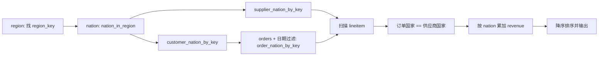

# 项目接手手册：从代码、实验到答辩

> 最后核对日期：2026-07-14；适用仓库：`db-tpch-q5`；目的：让一个没有参与原始实现的人，能够看懂、复现、修改并诚实地讲清这个项目。

> V7 已验证状态：V5 的 19 组 SF1 cold-process 结果保留为历史对照。当前正式
> 口径是 SF1/SF10 resident session、hybrid model 和 10 组 profiler 证据。
> `docs/CURRENT_STATUS.md`、`docs/artifacts/v7_*`、claim ledger 和论文优先于
> 本手册中明确标成“V5 历史”的旧计时段落。

## 0. 先记住这几个结论

1. 这个仓库实际上包含两套实验，不是一套。
   - 顶层项目 `MEMQ5`：专门执行 TPC-H Query 5 的内存列式 CPU/CUDA 程序。
   - `hashjoin-cpu/`：基于 ETH Zurich 2013 年内存哈希连接代码扩展的前期实验。
2. 顶层项目不是数据库，也不是通用 SQL 引擎。它只接受固定的 Q5 参数，并执行手写好的固定查询计划。
3. CPU 和三个 CUDA 模式使用同一个 CPU 端预处理计划。GPU 只负责最后的 `lineitem` 扫描和分组累加。
4. V7 的 SF1/SF10 各有 18 组配置、54 次 warmup、180 次 measured request，全部通过 oracle；哈希分别为 `542abf4003633c7c` 和 `b1351a421ba8dcfd`。
5. 当前实现使用 `revenue_1e4` 先精确聚合、最后舍入，已经修复逐明细截断问题。
6. resident session 把一次 setup 和重复 request 分开。fixed hybrid 的最佳 CPU 比例在 SF1/SF10 为 0.125/0.375；auto 有 33.89%/9.21% regret。
7. `hashjoin-cpu` 中的 VJ 是 direct-address vector index，不是 SIMD 向量指令。
8. `hashjoin-cpu` 的 star join `pro` 模式并没有调用原版 radix PRO，而是两阶段、会物化中间结果的开放寻址哈希连接。报告里的命名比实际实现更强。
9. 当前顶层 CPU 项目可直接构建并通过测试。`hashjoin-cpu` 也能构建，但老式 Autoconf 有两个容易踩中的构建问题，后文给出可靠命令。
10. Git 历史、Codex 会话和用户说明都表明实现主要由 AI 生成。接手的目标不是背报告，而是能沿代码路径解释，并能亲自做一次小修改和复验。

### 0.1 当前必须会讲的 V7 数字

| 项目 | SF1 resident | SF10 resident |
| --- | ---: | ---: |
| specialized CPU | 3.201 ms | 14.955 ms |
| copy / managed / mapped | 1.267 / 1.440 / 22.971 ms | 15.416 / 15.066 / 358.582 ms |
| fixed hybrid 最佳 | 1.160 ms，CPU=0.125 | 10.054 ms，CPU=0.375 |
| hybrid-auto | 1.553 ms，regret 33.89% | 10.980 ms，regret 9.21% |

这张表只比较已经常驻后的 request。第一次查询还要加 setup；例如 SF10 最佳
fixed hybrid setup 约 4997 ms，100 次摊销仍约 60 ms。profiler 时间是另一种
口径，只用来解释 mapped 远程读取和 CPU/GPU 阶段重叠。

## 1. 怎样使用这份手册

建议按下面的顺序接手：

1. 先读第 2、3 节，建立项目地图。
2. 在终端亲自执行第 11 节的 tiny 数据命令。
3. 一边打开源码，一边读第 5 至第 9 节。
4. 再学习第 13 至第 18 节的前期连接实验。
5. 用第 21 节的问题自测，不看答案先讲一次。
6. 答辩前看同目录下的 `DEFENSE_CHEATSHEET.md`。

阅读文档时的可信度顺序是：

```text
当前源码和实际运行结果
    > 原始 CSV / JSON / 日志
    > FINAL_REPORT.md
    > CURRENT_STATUS.md 等状态文档
    > FINAL_IMPLEMENTATION_PLAN.md 等历史计划
```

计划文档描述的是当时想做什么，不等于最后真正实现了什么。

## 2. 项目来源和时间线

Git 历史可以分成四个阶段：

| 阶段 | 主要提交 | 内容 |
| --- | --- | --- |
| Q5 雏形 | `aa03055` 至 `326fbb2` | 建立固定 Q5 执行器，增加 CUDA 路径，在 RTX 4090 上验证 |
| 正式数据和基线 | `9a3d580` 至 `575676e` | 加入官方 TPC-H SF1、cuDF 对照和提交报告 |
| 合并前期课程实验 | `bc7595d` 至 `23b7eec` | 将 `hashjoin-cpu`、CPU 连接实验和课程叙事并入仓库 |
| 补实验和改报告 | `4e6299c` 至 `40d13bf` | 加入 PyArrow full matrix，修正文档，重写学生口吻报告 |

当前本地分支比 `origin/main` 落后 2 个提交，但工作区里有正在修改的 `docs/FINAL_REPORT.md` 和对应 DOCX。接手时不要直接 `reset --hard`，否则会丢掉本地报告改写。

### AI 记录核对结果

- 仓库内没有项目级 `CLAUDE.md`、`AGENTS.md`、`.claude` 记忆或有效的 `.codex` 记忆内容。
- `~/.codex/memories` 为空。
- 找到的项目相关 Codex 会话主要是 2026-07-01 的 GPU 服务器执行过程，以及 2026-07-10 的报告改写过程。
- 2026-07-01 会话中，AI 实际检查了 RTX 4090、构建 CUDA、准备 TPC-H SF1、运行 GPU 模式和 cuDF。
- 检索到的 Claude 大日志只是其他会话顺带列出了该仓库路径，没有发现可作为项目设计依据的专门 Claude 记忆。

因此，理解项目时应依赖代码、Git 和实验产物，不应假设还有一份隐藏设计说明。

## 3. 仓库地图

```text
db-tpch-q5/
├── src/                         顶层 C++/CUDA 实现
│   ├── cli/memq5.cpp            命令行解析、加载数据、选择引擎
│   ├── common/                  列容器、日期、定点数、计时工具
│   ├── io/                      六张 TPC-H .tbl 表的裁剪加载器
│   ├── engine/                  Q5 参数、预处理计划、结果和哈希
│   ├── cpu/q5_cpu.cpp           CPU 最终扫描和聚合
│   └── cuda/q5_cuda.cu          三种 CUDA 内存模式和同一个核函数
├── tests/                       CTest 单元测试与 tiny fixture
├── baselines/                   Python、PyArrow、DuckDB、cuDF 对照
├── scripts/                     数据准备、实验矩阵、校验、汇总、打包
├── data/                        本地生成的数据和 TPC-H 工具，不进 Git
├── results/                     实验 CSV、环境、哈希检查和图，不进 Git
├── docs/                        Q5 设计、报告、运行手册和本手册
└── hashjoin-cpu/                独立的前期 CPU join 实验
```

最值得先打开的文件：

| 文件 | 先看什么 |
| --- | --- |
| `src/engine/q5_plan.cpp` | 六表连接如何变成三个按 key 直接索引的数组 |
| `src/cpu/q5_cpu.cpp` | CPU 如何切分 `lineitem`，线程本地聚合后归并 |
| `src/cuda/q5_cuda.cu` | copy、managed、mapped 的内存差别 |
| `src/common/fixed_point.hpp` | 收入的整数运算和精度问题 |
| `scripts/run_experiment_pipeline.py` | 一次完整实验会留下什么证据 |
| `hashjoin-cpu/src/vector_join.c` | VJ 和单线程 sort-merge |
| `hashjoin-cpu/src/parallel_radix_join.c` | PRVJ 如何嵌入 radix 分区框架 |
| `hashjoin-cpu/src/starjoin.c` | star join 三种模式的真实实现 |

## 4. 顶层任务到底是什么

TPC-H Q5 的含义可以概括为：在指定地区和一年时间范围内，找出客户与供应商属于同一国家的订单明细，按国家汇总收入，再按收入降序排列。

简化后的 SQL 关系是：

```sql
SELECT n_name,
       SUM(l_extendedprice * (1 - l_discount)) AS revenue
FROM customer, orders, lineitem, supplier, nation, region
WHERE c_custkey = o_custkey
  AND l_orderkey = o_orderkey
  AND l_suppkey = s_suppkey
  AND c_nationkey = s_nationkey
  AND s_nationkey = n_nationkey
  AND n_regionkey = r_regionkey
  AND r_name = 'ASIA'
  AND o_orderdate >= DATE '1994-01-01'
  AND o_orderdate < DATE '1995-01-01'
GROUP BY n_name
ORDER BY revenue DESC;
```

程序支持更换 `--region` 和起始 `--date`，结束日期固定为起始日期后一年。

### 六张表只加载需要的列

| 表 | 使用列 | 用途 |
| --- | --- | --- |
| `region` | `r_regionkey`, `r_name` | 找目标地区 key |
| `nation` | `n_nationkey`, `n_name`, `n_regionkey` | 过滤国家并保存国家名 |
| `supplier` | `s_suppkey`, `s_nationkey` | 供应商到国家映射 |
| `customer` | `c_custkey`, `c_nationkey` | 客户到国家映射 |
| `orders` | `o_orderkey`, `o_custkey`, `o_orderdate` | 日期过滤后，订单到客户国家映射 |
| `lineitem` | `l_orderkey`, `l_suppkey`, `l_extendedprice`, `l_discount` | 最终大表扫描和收入聚合 |

这叫 column pruning。它减少了内存占用，但仍然从文本 `.tbl` 逐行解析，并不是 Parquet 或 Arrow IPC 的高速列式输入。

## 5. 数据表示

### 5.1 列容器

`src/common/column.hpp` 的 `Column<T>` 底层是对齐的连续 `std::vector` 风格存储。执行时可以得到连续指针，这对 CPU 顺序扫描、`cudaMemcpy` 和 GPU 合并访存都方便。

报告里有时使用“Arrow-compatible”一词，更准确的说法是“Arrow-inspired columnar layout”：

- 数据是按列、连续、定长表示的。
- 字符串使用字典编码。
- 但它没有实现 Arrow C Data Interface、Schema、Array 或有效性位图协议。
- `Column<T>` 里的 `validity_` 没有真正初始化或参与执行，单独的 `Bitmap` 也没有用于 Q5。

### 5.2 字符串

地区名和国家名在加载时字典编码。数据列只存 `int32` code，字典中保存原字符串。Q5 的大表中没有字符串，因此 GPU 不需要处理变长字符串。

### 5.3 日期

日期转成相对 Unix epoch 的 `int32` 天数。比较日期时只做整数范围判断：

```text
start_date_days <= o_orderdate < end_date_days
```

### 5.4 金额和折扣

- `l_extendedprice` 解析成 `int64` 分。
- `l_discount` 解析成 `int32` 基点，1% 等于 100 基点。
- 当前收入公式是：

```cpp
(extendedprice_cents * (10000 - discount_basis_points)) / 10000
```

整数除法会截断不足一分的部分。这个决定保证不同语言基线容易得到同一个整数结果，但改变了官方 SQL 在求和前保留小数的语义。

## 6. 固定查询计划

`build_q5_plan_cpu()` 把多次哈希连接改成几个稠密 key 数组。逻辑如下：



三个关键映射：

```text
supplier_nation_by_key[suppkey] -> nationkey 或 -1
customer_nation_by_key[custkey] -> nationkey 或 -1
order_nation_by_key[orderkey]   -> nationkey 或 -1
```

`-1` 表示该 key 不符合地区或日期条件。最终扫描不需要通用哈希表，只需边界检查和数组读取。

这个方案快的前提是 TPC-H key 较稠密。如果 key 最大值很大而实际行很少，直接按最大 key 分配数组会浪费大量内存。

## 7. CPU 执行路径

入口是 `execute_q5_cpu()`：

1. 单线程调用 `build_q5_plan_cpu()`。
2. 按 `--threads` 将 `lineitem` 行号均分为连续区间。
3. 每个线程分配一个很小的 `revenue_by_nation` 本地数组。
4. 线程扫描自己的区间，检查订单国家和供应商国家是否相同。
5. 主线程等待所有 worker，逐国家归并本地数组。
6. 去掉收入为 0 的国家，按收入降序、国家名升序排序。

为什么不用多个线程同时写同一个聚合数组：国家数虽少，但共享写会产生原子操作或 cache line 竞争。线程本地数组几乎不占内存，最后归并也很便宜。

需要注意：`--threads` 只并行最后的 `lineitem` 扫描。地区、国家、供应商、客户和订单映射仍是单线程构建，所以线程数增加后总时间不会线性下降。

## 8. CUDA 执行路径

三个 GPU 引擎共用一个 `lineitem_q5_aggregate_kernel`。每个 GPU 线程处理一条 `lineitem`：

```text
读取 orderkey 和 suppkey
 -> 查 order_nation_by_key
 -> 查 supplier_nation_by_key
 -> 如果 nation 相同
 -> 计算整数 revenue
 -> atomicAdd(revenue_by_nation[nation], revenue)
```

CUDA block 固定为 256 个线程。每个命中行都直接对全局 25 国聚合数组做一次 `atomicAdd`，没有实现计划文档中提到的 shared-memory block reduction。

### 三种内存模式

| 引擎 | 输入内存 | GPU 如何读取 | 主要成本 |
| --- | --- | --- | --- |
| `gpu-copy` | `cudaMalloc` device memory | 先显式 H2D，再读显存 | 分配、H2D 拷贝、kernel、D2H |
| `gpu-managed` | `cudaMallocManaged` | CPU 填充后 prefetch 到 GPU | managed 分配、CPU copy、迁移和同步 |
| `gpu-mapped` | `cudaHostAllocMapped` pinned host memory | GPU 经 PCIe 零拷贝读取主机内存 | pinned 分配、CPU copy、较慢的远程读取 |

正式 SF1 上，`gpu-mapped` 的 kernel 中位数约 2.681 ms，比 copy/managed 的
1.347/1.345 ms 慢；它省掉了大块显式 H2D，却让 kernel 经 PCIe 取数据。

### 为什么 GPU 总时间反而比 CPU 慢

正式结果中 GPU kernel 很快，但整个程序不是常驻 GPU 服务。每次命令都会：

1. 新进程启动 CUDA runtime。
2. 读取并校验 Arrow 数据。
3. CPU 重新构建 Q5 映射。
4. GPU 重新分配输入缓冲区。
5. 复制或迁移数据。
6. 只执行一次较小的 SF1 查询。
7. 释放全部 GPU 内存并退出。

因此 SF1 的单次端到端 GPU 路径被启动、分配和传输成本主导。不能据此得出“GPU 不适合数据库”，只能说当前一次性进程、一次查询、SF1 规模下没有摊薄固定成本。

### V5 中 `--threads` 对 GPU 的含义

GPU 函数不使用 CPU worker 数。旧 full matrix 曾留下 1、2、4、8 四组冗余标签；
V5 正式矩阵已经修正，每个 GPU 模式只有 `threads=1` 这一组元数据。讲实验时应说：

> `threads=1` 不是只启动一个 CUDA thread。真正并行度由 256-thread blocks 和
> 输入行数决定；该字段只是统一运行记录 schema 的元数据。

## 9. 输出、结果哈希和计时

### 9.1 结果哈希

结果先按 revenue 降序排序。`result_hash_hex()` 再用 64 位 FNV-1a 顺序哈希
每行国家名和 `revenue_1e4` 精确整数。

哈希适合快速检查不同引擎是否返回完全相同的整数结果，但它不能回答：

- 公式是否符合官方 SQL 小数精度；
- 测试数据是否真的来自官方 dbgen；
- 两个相同实现是否共同包含同一个错误。

### 9.2 两种计时口径

V5 统一记录 `query_total_ms` 和 `process_elapsed_ms`。前者由后端报告查询阶段，
后者由外部 monitor 测量整个子进程。

```text
query_total_ms:
    backend query phases (see per-engine breakdown)

process_elapsed_ms:
    process startup + Arrow load/check + query + output + exit
```

cuDF 还单独报告 `load_ms`。跨后端比较时必须使用同名列，并说明后端对查询阶段
的边界；不能把一个后端的 query 和另一个后端的 process 比较。

### 9.3 GPU breakdown 也不是完全同口径

- `gpu-copy.h2d_ms` 包含显式 `cudaMemcpy`。
- `gpu-managed.h2d_ms` 主要记录 prefetch，不含 CPU 把原数据复制进 managed buffer 的时间。
- `gpu-mapped.h2d_ms` 为 0，表示没有大块显式输入 H2D；host prepare 和 kernel
  期间的远程读取分别属于其他阶段。
- `build + h2d + kernel + d2h` 小于 `total_ms`，差值里还有 CUDA runtime、分配、CPU copy、同步和释放。

因此 `time_breakdown.svg` 是“已命名阶段对比”，不是完整的总时间分解。

## 10. 基线实现

| 基线 | 实现方式 | 作用 | 当前状态 |
| --- | --- | --- | --- |
| `python` | 字典和 Python 循环 | 无依赖正确性参考 | 本次 SF1 可复跑 |
| `arrow-acero` | Arrow C++ filter/hash join/aggregate | 列式关系算子对照 | V5 已正式验证 |
| `duckdb` | SQL over `.tbl` | 通用数据库对照 | 正式环境未安装，未进入 full matrix |
| `cudf` | RAPIDS DataFrame | 通用 GPU DataFrame 对照 | V5 RTX 4090 正式验证 |

所有正式后端都使用相同的 `revenue_1e4` 精确语义：

- Python 使用整数 `// 10000`。
- DuckDB SQL 显式 `floor(...)`。
- cuDF 转成 `int64`。
- PyArrow 用整数除法/转换。

这解释了为什么项目内哈希一致，也进一步说明它们不是独立的官方语义 oracle。

## 11. 顶层项目的复现方法

### 11.1 CPU 构建和测试

```bash
cd /home/xuzihuan/db-tpch-q5
cmake -S . -B build -DMEMQ5_ENABLE_CUDA=OFF -DCMAKE_BUILD_TYPE=Release
cmake --build build -j 8
ctest --test-dir build --output-on-failure
python3 scripts/self_check.py --skip-cuda
```

2026-07-13 本次复验结果：

- 5/5 CTest 通过。
- Python 文件编译、tiny 数据校验、tiny CPU/Python pipeline 全部通过。

### 11.2 tiny 数据手工运行

```bash
./build/memq5 \
  --engine cpu \
  --data-dir tests/fixtures/tpch_q5_tiny \
  --region ASIA \
  --date 1994-01-01 \
  --threads 2 \
  --format rows
```

应看到：

```text
JAPAN,1900000,190.00
INDIA,900000,90.00
result_hash,248d10b6ee352953
```

### 11.3 SF1 CPU 运行

```bash
./build-arrow-cuda-release/memq5_arrow_query \
  --engine cpu-specialized \
  --dataset data/tpch_sf1_arrow \
  --region ASIA \
  --date 1994-01-01 \
  --threads 16 \
  --format benchmark
```

应得到 5 行结果，哈希为：

```text
542abf4003633c7c
```

### 11.4 PyArrow 运行

基础 Python 环境当前没有 PyArrow，已有 `memq5-cudf` 环境中是 PyArrow 23.0.1：

```bash
conda run -n memq5-cudf python baselines/arrow_q5.py \
  --dataset data/tpch_sf1_arrow \
  --region ASIA \
  --date 1994-01-01 \
  --format benchmark
```

### 11.5 CUDA 构建

RTX 4090 对应 architecture 89：

```bash
cmake -S . -B build-cuda \
  -DMEMQ5_ENABLE_CUDA=ON \
  -DMEMQ5_ENABLE_TESTS=ON \
  -DCMAKE_CUDA_ARCHITECTURES=89 \
  -DCMAKE_BUILD_TYPE=Release
cmake --build build-cuda -j 8
ctest --test-dir build-cuda --output-on-failure
```

V5 正式运行时 `nvcc` 为 12.6，GPU 0 为 RTX 4090，driver 595.71.05，cuDF
26.06.00。Arrow+CUDA Release CTest、compute-sanitizer、hybrid 和 cuDF 均在
真实 GPU 上复验通过。

还要注意历史环境曾出现版本口径混杂：PATH 上的 `nvcc` 为 12.6，某次 CMake 选择了 `/usr/bin/nvcc` 12.0，而驱动展示的 “CUDA Version” 是驱动支持上限 13.2。这三个数字不是同一概念。

## 12. 顶层正式实验怎样解释

### 12.1 数据规模

`data/tpch_sf1/memq5_manifest.json` 记录：

| 表 | 行数 |
| --- | ---: |
| region | 5 |
| nation | 25 |
| supplier | 10,000 |
| customer | 150,000 |
| orders | 1,500,000 |
| lineitem | 6,001,215 |

### 12.2 V5 cold-process 历史环境

- CPU：AMD EPYC 9654，2 sockets，384 logical CPUs。
- GPU：NVIDIA RTX 4090 24 GiB。
- 正式参数：`ASIA`、`1994-01-01`。
- 每组 3 次 warmup、10 次 measured cold process。
- full matrix 共 19 组配置、190 条测量记录且 0 error。

19 组配置的组成：

```text
specialized CPU: threads 1/2/4/8/16/32 = 6
Arrow Acero: threads 1/2/4/8/16/32 = 6
copy/managed/mapped = 3
hybrid CPU ratio 0.25/0.50/0.75 = 3
cuDF = 1
总计 19
```

### 12.3 V5 历史中位数（不要当成 V7 request）

| 引擎 | 代表参数 | internal total median | external elapsed median | 正确解释 |
| --- | --- | ---: | ---: | --- |
| specialized CPU | 16 threads | 61.414 ms | 381.285 ms | 固定 Q5 专用计划最快 |
| Arrow Acero | 32 threads | 321.535 ms | 707.231 ms | 通用算子计划准备较重 |
| cuDF | 1 | 116.427 ms | 3682.381 ms | query 快，cold Python/Conda 进程重 |
| gpu-copy | 1 | 314.151 ms | 1008.970 ms | 三种 CUDA 中最好 |
| gpu-managed | 1 | 358.158 ms | 1006.683 ms | prefetch 未超过 copy |
| gpu-mapped | 1 | 412.264 ms | 1134.574 ms | 无显式大 H2D，但远程读取更慢 |
| hybrid | 75% CPU | 222.832 ms | 888.370 ms | 正确并发，但未超过 pure CPU |

这张表是 V5 `summary.csv` 的中位数，不再混用早期 `.tbl` full matrix。

正式证据不要只看报告正文，原始位置是：

| 证据 | 路径 |
| --- | --- |
| 190 条 measured records | `docs/artifacts/v5_sf1/raw.csv` |
| 57 条 warmup records | `docs/artifacts/v5_sf1/warmups.csv` |
| 重算统计 | `docs/artifacts/v5_sf1/summary.csv` |
| 环境和依赖 | `docs/artifacts/v5_sf1/environment.json` |
| 正确性与覆盖 | `docs/artifacts/v5_sf1/correctness.json` |
| 完整 artifact checksums | `docs/artifacts/v5_sf1/manifest.json` |
| 论断状态 | `docs/research/CLAIM_LEDGER.md` |

### 12.4 精度问题已经怎样修复

旧实现对每条 lineitem 先截断到分，五个国家分别少约 5--6 元。V2 前已经改为
保存 `price_cents * (100-discount)` 的 `revenue_1e4`，所有行聚合完成后才显示
两位小数。现在五行与官方答案严格一致，正式 hash 为 `542abf4003633c7c`。

老师如果问“结果对不对”，最稳妥的回答是：

> hash 证明所有后端返回同一组精确整数；独立 oracle 又按十进制逐行比较官方
> `q5.out`。两层检查都通过。旧 `9f1f...` 只用于说明发现并修复过精度错误。

## 13. `hashjoin-cpu` 是什么

这是前期课程实验，来源是 ETH Zurich 的 VLDB 2013 main-memory hash join 代码。仓库在原版 NPO、PRO、RJ、PRH、PRHO 等算法上增加了：

- VJ：直接地址向量连接。
- payload width 1/2/4 字节。
- `madvise(MADV_HUGEPAGE)` 实验。
- PRVJ：radix partition + partition-local vector join。
- 内置 sort-merge 基线。
- 辅助空间统计。
- 两维表 star join 的 `npo/pro/vj` 模式。
- 自动扫参、作图和课程报告。

它与顶层 Q5 的联系是“先研究单个连接算子的内存访问，再把相关思想用到完整固定查询”。代码上两者是独立工程，没有链接同一个库。

## 14. 前期算法怎么讲

| 算法 | 核心结构 | 优点 | 主要问题 |
| --- | --- | --- | --- |
| NPO | 不分区的桶式哈希表 | 小表时简单、快 | 大表时随机访问、缓存和 NUMA 压力大 |
| PRO | 先 radix 分区，再局部哈希连接 | 大表局部性好 | 分区本身需要读写和同步 |
| VJ | `present[key]` + `payload[key]` | 稠密小 key 时 O(1) 直接索引 | key 范围大时空间、cache、TLB 成本高 |
| PRVJ | radix 分区后，每分区建小 VJ | 保留直接索引，改善局部性 | 多了分区成本，参数敏感 |
| sort-merge | 拷贝、`qsort` 两表、归并 | 算法结构直观 | 当前实现完全单线程，超大表极慢 |

### VJ 的真实结构

VJ 先扫描 R 找最大 key，然后分配：

```text
present[nslots]   每槽 1 字节，不是 bit-packed bitmap
payloads[nslots]  每槽 1、2 或 4 字节
```

构建 R 时检查重复 key，存 payload，并把 `present[key]` 置 1。探测 S 时先检查 key 范围和 present，再读取 payload，匹配计数由 present 决定。

当前实验的 payload 压缩只是合成存储宽度实验。最终只统计 match count，payload 被截短不会改变连接是否命中。因此不能把它解释成对真实业务 payload 精度无损的通用压缩。

VJ 的 index build 是单线程，S probe 才使用多个 pthread，并带 CPU affinity。

### PRVJ

PRVJ 复用原 `join_init_run()` 的 radix partition 框架。每个分区内将 key 右移 `NUM_RADIX_BITS`，得到更稠密的局部 slot，再建立 `present + payload` 向量。

它的思想是：全局 VJ 可能大到放不进 cache/TLB，先分区后每个局部向量更小，代价是多了一次分区。

### sort-merge

`SORTMERGE()` 明确 `(void)nthreads`，把 R、S 拷贝后分别调用 libc `qsort`，最后单线程归并。实验表里即使写 `threads=64`，也不等于 64 线程排序。

## 15. 前期连接实验结果

### 15.1 实验设计

- 固定 `|S| = 2^30`。
- 扫描 `|R| = 2^5 ... 2^30`，共 26 个点。
- 7 个变体：NPO、PRO、sort-merge、VJ-pw1/2/4、PRVJ-best。
- 最终汇总 CSV 有 182 个数据点，全部标记 OK。
- 绝大多数点只跑 1 次，不是脚本默认的 3 次。
- `R=2^5` 使用 32 线程，其余主要使用 64 线程。

因此结果适合观察数量级和拐点，不适合声称有稳定方差、置信区间或显著性。

### 15.2 主要趋势

- R 很小时，NPO 和 VJ 直接访问最有优势。
- R 增大后，VJ 的向量工作集跨过 cache 和 TLB 容量，性能明显下降。
- PRVJ 通过分区恢复局部性。
- `R=S=2^30` 时，PRO 是这些通用连接中最强的一个。
- 当前单线程 sort-merge 在超大点非常慢。

`R=2^30` 的记录值：

| variant | time | throughput |
| --- | ---: | ---: |
| PRO | 2,080.8 ms | 516.0 M tuples/s |
| PRVJ | 2,252.6 ms | 476.7 M tuples/s |
| NPO | 7,884.3 ms | 136.2 M tuples/s |
| VJ pw1 | 46,172.0 ms | 23.3 M tuples/s |
| VJ pw4 | 55,936.9 ms | 19.2 M tuples/s |
| sort-merge | 384,442.4 ms | 2.79 M tuples/s |

吞吐公式在脚本中是 `S_SIZE / time_usec`，单位正好是 million tuples/s。

## 16. star join 实验

### 16.1 合成数据

`sf=100` 时：

- lineorder L：`100 * 6,000,000 = 600,000,000` 行。
- orders O：`100 * 1,500,000 = 150,000,000` 行。
- partsupp PS：`100 * 800,000 = 80,000,000` 行。

L 的 key 和 payload 分别作为两个外键。生成数据保证每条 L 都能在 O 和 PS 中命中，没有选择率变化或无匹配场景。

聚合表达式最终对每条命中行贡献 3，因此：

```text
matches = 600,000,000
aggregate_sum = 1,800,000,000
```

### 16.2 三种模式的真实含义

| 模式标签 | 实际实现 |
| --- | --- |
| `npo` | 为 O、PS 建两个开放寻址线性探测哈希表，一次 pipeline 扫描 L |
| `vj` | 为 O、PS 建两个直接地址向量，一次 pipeline 扫描 L |
| `pro` | 仍使用同类开放寻址哈希表，第一阶段产生中间关系，再做第二次 probe |

这里的 `pro` 没有调用 `parallel_radix_join.c` 中的原版 PRO。答辩时可以称为“代码中标记为 pro 的物化两阶段哈希连接”，不要直接说它就是 radix partition PRO。

### 16.3 SF100 结果

| mode | time | aux bytes | 解释 |
| --- | ---: | ---: | --- |
| VJ | 3,645.5 ms | 460,000,004 | 稠密连续 key、全命中，直接索引非常有利 |
| NPO | 15,552.3 ms | 9,663,676,416 | 开放寻址表更大，probe 有随机性 |
| `pro` label | 17,355.1 ms | 14,463,676,416 | 还物化中间结果，空间和时间更高 |

这个结论只适用于当前强烈偏向 VJ 的合成数据。真实星型查询若 key 稀疏、存在过滤、维表更新或多种选择率，排名可能改变。

starjoin 的 `time_ms` 不含合成数据生成，但包含哈希表/向量构建和查询执行。前期实验的原始证据集中在 `hashjoin-cpu/docs/data/`，其中 full sweep 使用 `final_full_all_s2e30_summary.csv`，SF100 star join 使用 `starjoin_sf100_t64.csv`。

## 17. NUMA、预取和大页

### NUMA

早期实验机器是双路 Intel Xeon Gold 5220：

- 2 sockets，每 socket 18 cores，SMT2，共 72 logical CPUs。
- 本地内存延迟约 82 ns。
- 跨 NUMA 延迟约 141 至 156 ns。
- 本地读带宽约 74 GB/s，远端约 34 GB/s。

`--basic-numa` 主要通过 first-touch 把输入 relation 分散到线程本地节点。它没有完整地对 VJ/hash 辅助结构做 NUMA 分区分配。

### 软件预取

star join 的 NPO/VJ pipeline 可以按 prefetch distance 提前触碰未来查找位置。预取是否有效取决于访问可预测性、距离和内存延迟，不是距离越大越好。

### 大页

`--vj-hugepage` 只是对分配内存调用 `madvise(MADV_HUGEPAGE)`，请求 Transparent Huge Pages。它不保证内核一定分配 2 MiB huge pages，也不是预留 hugetlbfs 页面。

## 18. `hashjoin-cpu` 的可靠构建方法

这个子项目的上游目录没有完整打包 `lib/intel-pcm-1.7`。默认不开 performance counters 时程序不需要它，但只要 Automake 尝试重生成 `Makefile.in`，仍会因目录缺失报错。

另一个坑在 `configure.ac`：只要显式传入 `--disable-perfcounters`，`AC_ARG_ENABLE` 的 action 仍会执行 `CC="g++"`，于是 `.c` 文件被错误地按 C++ 编译。

当前可靠命令是：

```bash
cd /home/xuzihuan/db-tpch-q5/hashjoin-cpu

# 避免 make 因时间戳触发不必要的 Automake 重生成。
touch aclocal.m4 configure config.h.in Makefile.in src/Makefile.in

# 不要写 --disable-perfcounters；省略即为默认关闭。
CC=gcc ./configure \
  --disable-key8B \
  CPPFLAGS="-DNUM_PASSES=2 -DNUM_RADIX_BITS=18"

make -j4
bash scripts/self_check_assignment.sh
```

2026-07-13 本次复验：

- NPO、PRO、sort-merge、VJ 1/2/4 byte、VJ hugepage、PRVJ 小数据检查通过。
- starjoin npo/pro/vj 的 SF1 检查通过。
- VJ 手工运行返回 `Results = 4096`。
- starjoin VJ SF1 返回 `matches=6,000,000`、`aggregate=18,000,000`。

## 19. 历史不一致清单与 V6 状态

下面保留接手审计发现的问题，同时写明 V6 是否已经修复。

| 历史说法或问题 | V6 实际状态 |
| --- | --- |
| Arrow-compatible columns | 已改为真实 Arrow IPC、C++ loader 和 Acero 接口 |
| GPU 构建 order map | order/customer/supplier map 全由 CPU 构建 |
| GPU shared-memory reduction | 每个命中行直接做全局 `atomicAdd` |
| Arrow C++/Acero 基线 | 已实现真实 Arrow C++ Acero 计划 |
| benchmark 先 warmup | V5 每组保留 3 条 warmup，再做 10 条 measured |
| 汇总含 min/max/p95 | V5 从 raw 重算 min/median/max/p95/stddev |
| 记录吞吐、bytes、RSS | V5 schema 已包含这些字段；GPU peak memory 明确 unsupported |
| GPU 线程扩展性 1/2/4/8 | V5 去掉冗余 sweep，每个 GPU 模式只留一组元数据 |
| breakdown 是完整总时间 | allocation/runtime/CPU copy 等有较大未命名余量 |
| 数据校验包含 FK 完整性 | validator 主要解析并计数，没有真正逐 FK 检查 |
| CUDA CTest 通过就代表 GPU 跑过 | 无设备统一返回 77 并由 CTest 标为 skipped；正式记录另有真实 GPU 运行 |
| 项目结果等于官方 Q5 | `revenue_1e4` 修复后已由独立 oracle 逐行验证 |
| VJ present bitmap | 实际是每 key 1 byte，不是 1 bit |
| starjoin PRO 是 radix PRO | 实际是开放寻址哈希表的物化两阶段版本 |
| sort-merge 用 64 线程 | 当前实现忽略 `nthreads`，是单线程 `qsort` |
| 最终 sweep 每点 3 次 | 正式 CSV 中每点主要只有 1 次 |

## 20. 证据边界和可以下的结论

### 可以较有把握地说

- 两个子项目的核心代码在当前仓库中存在，并且 CPU 小数据路径能构建和运行。
- 顶层 Arrow CPU、CUDA、hybrid 和 cuDF 输出一致且通过官方 oracle。
- 正式 SF1 行数与 TPC-H manifest 相符。
- 当前 CPU 多线程只加速最终大表扫描。
- 一次性 SF1 GPU 查询的固定成本超过 kernel 节省。
- 稠密连续 key、小工作集时 direct vector index 很有优势；工作集变大后 cache/TLB 压力明显。

### 不能过度声称

- 可以说当前 ASIA/1994 参数的五行数值严格符合官方 Q5；不能外推其他参数。
- 不能说 GPU 普遍慢于 CPU。
- 不能把当前 mapped 模式称为完整的异步 overlap 优化。
- 不能说 full matrix 测了 GPU 的 CPU 线程扩展性。
- 不能说前期 1-repeat sweep 有统计显著性。
- 不能说 starjoin `pro` 是原版 PRO 算法。
- 不能把 VJ 结果直接推广到稀疏 key 或真实业务数据。

## 21. 老师可能会问什么

### Q1：为什么这是列式执行？

因为每个字段单独存成连续数组，Q5 只加载和扫描需要的列，而不是把整行所有字段放在一个结构体里。最终 `lineitem` 扫描只读取 orderkey、suppkey、price 和 discount 四列。

### Q2：为什么不用通用哈希连接？

TPC-H key 较稠密且查询固定，可以用按 key 下标的数组把 join 变成直接查表，减少哈希计算和冲突。但这牺牲了通用性，也可能在稀疏 key 上浪费内存。

### Q3：CPU 多线程为什么不能线性加速？

只有 `lineitem` 扫描并行，plan build 仍是单线程；还存在创建线程、内存带宽和最后归并的固定成本。

### Q4：为什么 GPU kernel 0.2 ms，总时间却 200 多 ms？

当前每次都是新进程、新 CUDA context、新分配和一次查询。kernel 只是一小段，固定初始化、分配、CPU plan、数据迁移和释放没有被摊薄。

### Q5：mapped memory 为什么 kernel 更慢？

输入仍在主机 pinned memory，GPU load 经 PCIe 读取，带宽和延迟都弱于显存。它减少了显式 H2D，但把代价移进了 kernel。

### Q6：为什么用 atomicAdd 不会特别糟？

实现简单且输出只有 25 个国家，但高命中时会集中竞争。更进一步可以先做 block-local shared-memory aggregation，再把每 block 的 25 个值原子加到全局。

### Q7：结果哈希能证明什么？

它能快速证明不同引擎返回的排序后国家和整数收入相同。它不能证明共同采用的收入公式就是官方语义。

### Q8：为什么官方答案和项目差几元？

项目把每条明细的收入先整数除法截断到分，再求和；官方 decimal 表达式保留更多小数后求和。数百万行的小截断累计成几元。

### Q9：VJ 的 Vector 是 SIMD 吗？

不是。这里是用 key 直接索引的 vector/array。核心优化来自 direct addressing 和连续内存，不是向量指令。

### Q10：VJ 为什么小 R 快、大 R 慢？

小向量能留在 cache/TLB，查找只是简单下标；大向量会产生更大的内存占用、随机页访问和 TLB miss，直接索引优势被内存层次成本抵消。

### Q11：PRVJ 为什么可能恢复性能？

radix partition 先按低位把数据分组，每个分区再建较小的 direct vector，使工作集更容易落在 cache/TLB 中。

### Q12：为什么 starjoin VJ 快这么多？

数据 key 连续、所有事实行都命中、没有真实选择率，正好是 direct vector 最理想的场景；同时它避免了开放寻址探测和中间物化。

### Q13：这个项目最大的改进空间是什么？

decimal、Arrow、resident、warmup和profiler已经完成。现在第一优先是减少hybrid
两侧重复setup并多次测量setup分布；第二是改进auto模型；第三是增加并发、NUMA
和多硬件；第四才是继续优化当前原子聚合kernel。

### Q14：哪些工作是你能亲自说明的？

应如实说实现和初始报告主要由 AI 辅助产生，但自己已经完成源码审计、复现测试、发现精度和实验口径问题，并能沿函数解释数据如何流动。不要把 AI 生成的历史包装成亲手从零实现。

## 22. 接手练习

只读不够。建议依次完成四个小任务，每个任务都能形成自己的理解证据。

### 练习 1：手算 tiny fixture

打开 `tests/fixtures/tpch_q5_tiny/*.tbl`，手工找出两条命中明细，算出 JAPAN 190.00、INDIA 90.00。然后对照 `q5_plan.cpp` 和 `q5_cpu.cpp`。

完成标准：不看报告，能在白纸上画出六表到三个映射的过程。

### 练习 2：加一条调试统计

在 CPU scan 中统计：总 lineitem 数、合法 order 数、合法 supplier 数、国家匹配数。先单线程实现，确认 tiny 的每级过滤数量，再考虑线程本地归并。

完成标准：能解释每个过滤条件排除了什么。

### 练习 3：追踪一次正确性证明

从 `v7_sf1_resident/raw.csv` 找一条request，沿result hash追到
`correctness.json`、oracle和manifest。再故意复制bundle并改一个金额，确认审计
或correctness materializer拒绝它。

完成标准：理解“跨引擎一致”“官方语义正确”和“证据未被修改”是三件事。

### 练习 4：重新设计一个公平 benchmark

至少增加：

- 固定预热次数。
- 查询内计时和含 I/O 计时分开。
- 同一进程重复执行，观察常驻数据情况。
- median、min、max、p95。
- 数据传输字节数和峰值 RSS。
- GPU 模式不再生成虚假的 thread 维度。

完成标准：能说明每张图的横轴、纵轴、样本数和计时边界。

## 23. 建议的修复优先级

| 优先级 | 工作 | 原因 |
| --- | --- | --- |
| P0 | 减少 hybrid 两侧重复 setup | 决定少量请求能否真正受益 |
| P0 | 重复测量 setup 分布 | 当前每配置只有一次 setup |
| P1 | 改进 auto 特征和校准 | SF1 regret 为 33.89% |
| P1 | 增加并发、NUMA 和多硬件 | 当前结论只有单机两个规模 |
| P1 | 修复 `hashjoin-cpu` 构建系统和缺失可选依赖 | 影响他人复现 |
| P1 | 更正 starjoin `pro`、sort-merge 和 bitmap 说法 | 影响算法讲解准确性 |
| P2 | GPU block-local aggregation | 当前仍使用全局原子聚合 |
| P2 | 扩展到其他 TPC-H 查询 | 检查结论是否只属于 Q5 |

## 24. 最后的讲解主线

把整个课程项目串起来时，可以用下面这条主线：

> 前期先用 NPO、PRO、VJ、PRVJ 研究 key 分布、cache/TLB、NUMA 和额外空间怎样影响单个内存连接算子。后期不再做通用 join，而是把固定 TPC-H Q5 拆成几个按 key 直接索引的映射，再把最大的 lineitem 扫描分别放到 CPU 多线程和三种 CUDA 内存模式上。实验说明算法阶段很快，但完整系统表现还受文本加载、运行时初始化、分配和传输支配。同时，源码审计发现项目内结果一致不等于严格符合官方 decimal 语义，这也是接手后最先要修正的地方。

能够把这段话展开成 5 分钟，并能回答第 21 节的问题，就不再只是“拿到一份 AI 做的项目”，而是已经开始真正拥有它。
