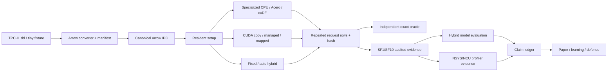

# 最终架构图

```mermaid
flowchart LR
  T["TPC-H .tbl / tiny fixture"] --> P["Arrow converter + manifest"]
  P --> A["Canonical Arrow IPC"]
  A --> S["Resident setup"]
  S --> C["Specialized CPU / Acero / cuDF"]
  S --> G["CUDA copy / managed / mapped"]
  S --> H["Fixed / auto hybrid"]
  C --> R["Repeated request rows + hash"]
  G --> R
  H --> R
  R --> O["Independent exact oracle"]
  R --> V["SF1/SF10 audited evidence"]
  V --> M["Hybrid model evaluation"]
  V --> N["NSYS/NCU profiler evidence"]
  M --> L["Claim ledger"]
  N --> L
  L --> Q["Paper / learning / defense"]
```

最容易讲错的地方：Arrow是统一输入；CPU仍构建过滤传播计划；GPU主要扫描
lineitem；hybrid是数据分区；V7 request不包含setup；profiler时间不参与普通
性能排名。
