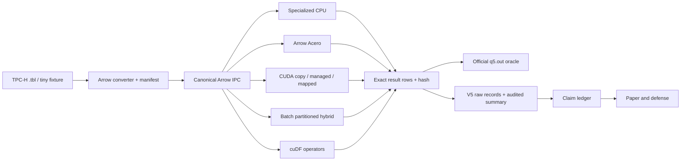

# 最终架构图

```mermaid
flowchart LR
  T["TPC-H .tbl / tiny fixture"] --> P["Arrow converter + manifest"]
  P --> A["Canonical Arrow IPC"]
  A --> S["Specialized CPU"]
  A --> E["Arrow Acero"]
  A --> G["CUDA copy / managed / mapped"]
  A --> H["Batch partitioned hybrid"]
  A --> C["cuDF operators"]
  S --> R["Exact result rows + hash"]
  E --> R
  G --> R
  H --> R
  C --> R
  R --> O["Official q5.out oracle"]
  R --> V["V5 raw records + audited summary"]
  V --> L["Claim ledger"]
  L --> Q["Paper and defense"]
```

最容易讲错的地方：Arrow 是统一输入；CPU 仍负责构建过滤传播计划；GPU 手写
kernel 只扫 lineitem；hybrid 是数据分区；cuDF 执行通用关系算子。
