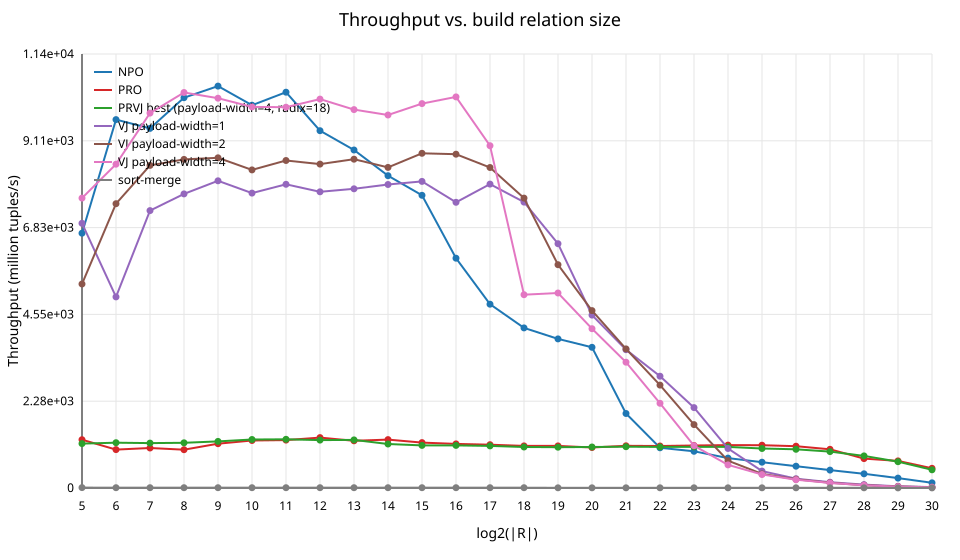
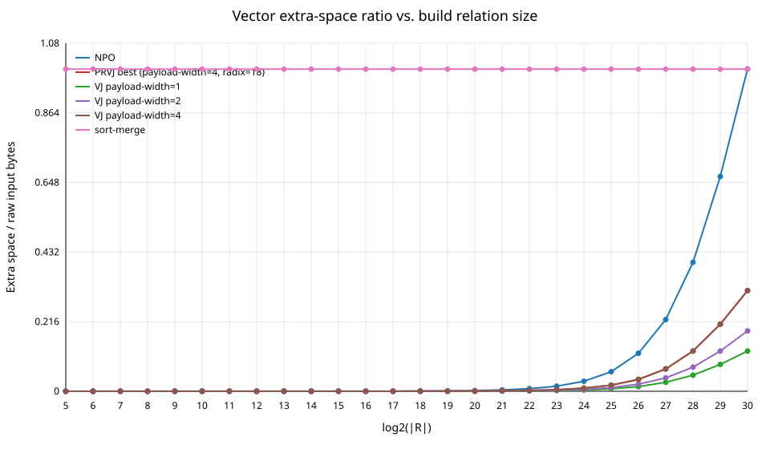
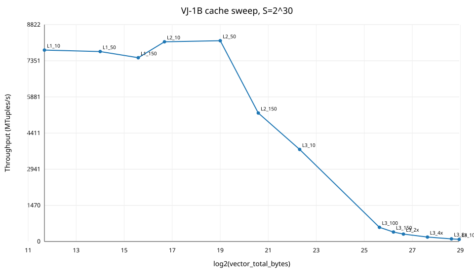

# 内存连接算法探索课程报告

## 报告说明

本报告按照 `/home/xuzihuan/内存连接算法探索.pdf` 的课程要求重新整理。该要求文档中第 1 到第 5 项对应前期实验与扩展算法探索，第 6 项对应期中 Star Join 多表连接实验；本课程的期末报告则是另一个独立项目：`db-tpch-q5`，即 TPC-H Q5 CPU/GPU 异构执行实验。

因此，本报告的组织方式如下：

1. 第 1 到第 5 章：前期实验与扩展算法探索，包括硬件参数测试、NPO/PRO/sort-merge 综合对比、VJ/PRVJ、VJ 工作集与 cache/TLB 分析。
2. 第 6 章：期中 Star Join 多表连接实验。
3. 第 7 章：期末 `db-tpch-q5` 项目，即 TPC-H Q5 CPU/GPU 查询引擎实验。

开源项目链接：

```text
https://github.com/zihuanxu/db-tpch-q5
```

其中 CPU hashjoin 前期与期中代码位于 `hashjoin-cpu/` 子目录；期末 TPC-H Q5/GPU 代码位于仓库根目录，详细报告为 `docs/FINAL_REPORT.md/.docx`。

## 1 通过测试工具了解服务器 CPU 关键硬件配置

### 1.1 实验环境

本实验在一台双路 Intel Xeon 服务器上完成，系统为 Linux。硬件与系统关键信息通过 `lscpu`、`numactl --hardware`、`/sys/devices/system/cpu/cpu0/cache/*` 和 Intel MLC v3.12 获取。

| 项目 | 实测结果 |
|---|---:|
| CPU 型号 | Intel Xeon Gold 5220 @ 2.20GHz |
| Socket 数 | 2 |
| 每路核心数 | 18 |
| SMT | 2 线程/核 |
| 总逻辑核数 | 72 |
| NUMA 节点数 | 2 |
| NUMA 距离 | 本地 10，远端 21 |
| L1d cache | 1.1 MiB, 36 instances |
| L2 cache | 36 MiB, 36 instances |
| L3 cache | 49.5 MiB, 2 instances |
| Memory | node0 128569 MB, node1 128963 MB |

前期报告初版中使用 mbw 和 lmbench 做近似测量。最终版补充 Intel MLC v3.12 的延迟和带宽矩阵，使硬件参数与后续算法性能分析的对应关系更明确。

### 1.2 NUMA 延迟与带宽

MLC latency matrix，单位 ns：

| 来源 NUMA node | 目标 node 0 | 目标 node 1 |
|---:|---:|---:|
| node 0 | 82.8 | 140.8 |
| node 1 | 155.6 | 81.5 |

MLC read-only bandwidth matrix，单位 MB/s：

| 来源 NUMA node | 目标 node 0 | 目标 node 1 |
|---:|---:|---:|
| node 0 | 74078.8 | 34280.9 |
| node 1 | 34360.1 | 74238.6 |

结论：

1. 本地 NUMA 访问延迟约 81 到 83 ns，远端 NUMA 访问延迟约 141 到 156 ns。
2. 本地读带宽约 74 GB/s，远端读带宽约 34 GB/s。
3. 连接算法中大量 hash table、partition buffer 或 vector index 访问都会受到 NUMA 和 cache 层次影响。

### 1.3 NUMA 对比实验

在 `R=S=2^24`、16 线程下，对 NPO、PRO、VJ 分别测试默认分配、`--basic-numa` 和 `numactl --interleave=all`。

| 算法 | 内存放置 | 时间 ms | 结果数 |
|---|---|---:|---:|
| NPO | none | 478.582 | 16777216 |
| NPO | `--basic-numa` | 257.520 | 16777216 |
| NPO | interleave | 241.643 | 16777216 |
| PRO | none | 202.307 | 16777216 |
| PRO | `--basic-numa` | 120.857 | 16777216 |
| PRO | interleave | 145.072 | 16777216 |
| VJ-1B | none | 430.644 | 16777216 |
| VJ-1B | `--basic-numa` | 458.470 | 16777216 |
| VJ-1B | interleave | 458.208 | 16777216 |

结果分析：

1. NPO 和 PRO 明显受益于 NUMA 优化。
2. PRO 的 `--basic-numa` 效果最好，说明 radix partition 后的局部访问更容易从本地 NUMA 分配中受益。
3. VJ 在该点没有受益，说明当 vector index 较紧凑时，瓶颈不一定是 NUMA 放置，而可能是随机数组访问、cache/TLB 或后续更大工作集问题。

## 2 开源连接算法研究

### 2.1 研究对象与代码基线

本实验基于 ETH Zurich VLDB 2013 main-memory hash join 开源代码框架进行扩展。最终关注以下代表算法：

| 算法 | 类型 | 特点 |
|---|---|---|
| NPO | 哈希连接 | 无分区，固定开销小，小数据下通常最快 |
| PRO | 哈希连接 | Parallel Radix Join，硬件感知型分区实现 |
| sort-merge | 排序归并 | 作为排序归并代表实现 |
| VJ | Vector Join | 利用连续主键构造 vector index，用数组访问替代 hash probe |
| PRVJ | Partitioned Vector Join | 将 radix partition 与 VJ 结合，缩小局部 vector 工作集 |

### 2.2 代码增强与统计项补充

为了满足课程要求，源码做了以下增强：

1. 在 `mchashjoins` 中增加统一算法开关，支持 `NPO`、`PRO`、`sort-merge`、`VJ`、`PRVJ` 和 `starjoin`。
2. NPO 增加 hash table 空间统计：

```text
NPO_STATS_CSV_HEADER,hash_table_bytes,total_extra_space_bytes,primary_bucket_bytes,overflow_bucket_bytes
```

3. VJ 增加 vector index 空间统计：

```text
VJ_STATS_CSV_HEADER,payload_width_bytes,vector_index_bytes,vector_total_bytes,total_extra_space_bytes
```

4. PRVJ 和 sort-merge 接入统一统计脚本，便于汇总吞吐率和空间开销。
5. 新增 Star Join 数据生成和执行路径，用于期中多表连接实验。
6. 新增 `scripts/self_check_assignment.sh`，用于构建和小规模正确性自检。

关键实现文件如下：

- `src/main.c`
- `src/no_partitioning_join.c`
- `src/parallel_radix_join.c`
- `src/vector_join.c`
- `src/starjoin.c`
- `src/starjoin.h`

### 2.3 算法执行入口

典型命令如下：

```bash
./src/mchashjoins -a NPO
./src/mchashjoins -a PRO
./src/mchashjoins -a sort-merge
./src/mchashjoins -a VJ --payload-width=1
./src/mchashjoins -a VJ --payload-width=2
./src/mchashjoins -a VJ --payload-width=4
./src/mchashjoins -a VJ --payload-width=1 --vj-hugepage
./src/mchashjoins -a PRVJ --payload-width=4
./src/mchashjoins --starjoin=npo --sf=100 -n 64
./src/mchashjoins --starjoin=pro --sf=100 -n 64
./src/mchashjoins --starjoin=vj  --sf=100 -n 64 --payload-width=1
```

## 3 综合对比测试与扩展算法测试

### 3.1 实验设计

PDF 第 3 项要求进行 full sweep，第 4 项要求加入 VJ 和 PRVJ 后继续统一比较。因此这里将 NPO、PRO、sort-merge、VJ 和 PRVJ 放入同一组前期综合实验中。

| 项目 | 取值 |
|---|---|
| 固定探测表 `|S|` | `2^30` tuples |
| 构建表 `|R|` | `2^5 ~ 2^30`，共 26 个点 |
| 基线算法 | NPO, PRO, sort-merge |
| 扩展算法 | VJ-1B, VJ-2B, VJ-4B, PRVJ-4B |
| 性能指标 | 吞吐率 MTuples/s |
| 空间指标 | extra space / input |

原始 CSV 保存在：

- `docs/data/final_full_all_s2e30_summary.csv`
- `docs/data/final_full_all_s2e30_raw.csv`

### 3.2 综合性能结果

合并后 7 个变体各 26 个点全部为 `OK`：

- NPO
- PRO
- sort-merge
- VJ-1B、VJ-2B、VJ-4B
- PRVJ-4B

吞吐曲线如下：



图 3-1 Full sweep 吞吐率总览

空间开销曲线如下：



图 3-2 Full sweep 空间开销对比

选取关键点的吞吐率如下，单位 MTuples/s：

| log2(|R|) | NPO | PRO | sort-merge | VJ-1B | VJ-2B | VJ-4B | PRVJ-4B |
|---:|---:|---:|---:|---:|---:|---:|---:|
| 5 | 6686.06 | 1266.16 | 9.24 | 6944.26 | 5351.32 | 7605.43 | 1165.40 |
| 20 | 3690.51 | 1062.53 | 6.43 | 4535.82 | 4653.81 | 4178.67 | 1075.71 |
| 24 | 784.09 | 1126.27 | 5.86 | 1035.26 | 716.63 | 606.64 | 1077.05 |
| 28 | 373.69 | 772.47 | 4.60 | 89.43 | 73.70 | 71.69 | 842.03 |
| 30 | 136.19 | 516.02 | 2.79 | 23.26 | 20.40 | 19.20 | 476.67 |

关键空间开销比如下：

| log2(|R|) | NPO | sort-merge | VJ-1B | VJ-2B | VJ-4B | PRVJ-4B |
|---:|---:|---:|---:|---:|---:|---:|
| 24 | 0.031010 | 1.000000 | 0.003846 | 0.005769 | 0.009615 | 0.009615 |
| 30 | 1.000122 | 1.000000 | 0.125000 | 0.187500 | 0.312500 | 0.312500 |

结果分析：

1. 小 R 下，NPO 和直接 VJ 的固定开销低，吞吐最高。
2. PRO 在大 R 下更稳定，说明 radix partition 能有效缓解大 hash table 的随机访存问题。
3. sort-merge 在本实现中吞吐明显低于 hash/vector 方案，但空间开销可预测。
4. VJ 在小工作集时很快，但当 vector index 工作集变大后吞吐快速下降。
5. PRVJ 在大 R 下明显优于直接 VJ，说明分区可以恢复一部分局部性。

## 4 VJ 算法性能分析研究

PDF 第 5 项要求继续以 VJ 为例探索内存连接算法性能决定性因素，包括性能估算、cache 拐点、TLB 影响和大页面尝试。

### 4.1 VJ 与 PRVJ 算法设计

VJ 的核心思想是利用 R 表主键连续整数的特点，用 vector index 替代 hash table。构建阶段按 key 将 payload 写入 vector；probe 阶段用 S 表 key 直接作为 vector 下标访问。

VJ 的优点是：

1. 避免 hash 计算。
2. 避免链式 bucket 访问和冲突处理。
3. 在 key range 小、vector index 可缓存时性能很高。
4. 可以通过 `payload_width=1/2/4` 模拟不同 payload 压缩率。

VJ 的问题是：

1. vector index 大小由 `max_key` 决定，不只由 `|R|` 决定。
2. key range 过大时，vector 工作集会超过 L3 cache 和 TLB 覆盖能力。
3. probe 阶段退化为大量随机内存访问。

PRVJ 的设计目标是缓解这个问题。它先对数据进行 radix partition，使每个分区内的 key range 变小，再在分区内部使用 VJ，从而缩小局部 vector 工作集。

### 4.2 VJ 工作集实验

VJ cache-size sweep 固定 `S=2^30`、64 线程、`payload_width=1`，让 vector index 大小覆盖 L1/L2/L3 的 10% 到 150%，并继续扩展到 L3 的 10 倍。



图 4-1 VJ vector 工作集大小与吞吐关系

关键点如下：

| label | vector bytes | cache ratio | time ms | throughput MT/s |
|---|---:|---:|---:|---:|
| L1_10 | 3,278 | 0.10 | 137.894 | 7786.72 |
| L2_50 | 524,290 | 0.50 | 131.454 | 8168.19 |
| L2_150 | 1,572,866 | 1.50 | 205.453 | 5226.22 |
| L3_100 | 51,904,514 | 1.00 | 1861.238 | 576.90 |
| L3_10x | 519,045,122 | 10.00 | 12352.788 | 86.92 |

可以看到，VJ 在工作集落入 cache 时吞吐很高；当 vector 工作集接近或超过 L3 后，性能迅速下降。

### 4.3 性能模型与 perf 观察

简化代价模型如下：

```text
T ~= T_build_vector(R, W) + T_probe(S, W)
W ~= max_key(R) * (present_bytes + payload_width)
```

其中 `W` 是 vector index 工作集大小。该模型强调：VJ 的性能不只由 `|R|` 决定，还由 key range 和 payload width 决定。

perf 代表性计数如下：

| payload width | log2(|R|) | vector bytes | time ms | cache miss rate | dTLB miss rate |
|---:|---:|---:|---:|---:|---:|
| 1 | 20 | 2,097,154 | 24.214 | 46.36% | 4.03% |
| 1 | 24 | 33,554,434 | 466.315 | 52.33% | 7.68% |
| 4 | 24 | 83,886,085 | 595.599 | 63.02% | 8.03% |

当前机器 `HugePages_Total=0`，THP 为 `madvise` 模式。代码实现了 `--vj-hugepage`，在 VJ vector 分配后调用 `madvise(MADV_HUGEPAGE)`；实测中 dTLB miss rate 未出现稳定改善，因此将其记录为大页尝试和环境限制。

### 4.4 前期扩展算法小结

VJ/PRVJ 实验是前期报告的扩展算法部分，不是期末项目。该阶段结论是：

1. 小范围连续 key 场景下，VJ 可以用低空间开销获得高吞吐。
2. 直接 VJ 的主要限制是 vector index 工作集超过 cache/TLB 覆盖能力。
3. PRVJ 通过分区恢复局部性，在大 R 下显著优于直接 VJ。
4. hardware-conscious join 的关键不是算法名，而是工作集与 cache、TLB、NUMA 的匹配关系。

## 5 期中课程报告：Star Join 多表连接

### 5.1 任务要求

PDF 第 6 项要求探索不同算法的多表连接性能，基于 `npo`、`pro`、`vj` 实现 star join：

```bash
./src/mchashjoins --starjoin=npo --sf=100 -n <threads>
./src/mchashjoins --starjoin=pro --sf=100 -n <threads>
./src/mchashjoins --starjoin=vj  --sf=100 -n <threads>
```

数据模型如下：

| 表 | 结构 | 规模 |
|---|---|---:|
| L | `<FKO, FKPS, PAYLOAD>` | `sf * 6000000` |
| O | `<PK, PAYLOAD>` | `sf * 1500000` |
| PS | `<PK, PAYLOAD>` | `sf * 800000` |

查询任务为：

```sql
select sum(O.PAYLOAD - (L.PAYLOAD - PS.PAYLOAD))
from L, O, PS
where L.FKO = O.PK
  and L.FKPS = PS.PK;
```

按表达式和常量 `O.PAYLOAD=3`、`L.PAYLOAD=1`、`PS.PAYLOAD=1`，每行贡献为 3。因此本实验使用 `matches` 验证连接基数，用 `aggregate_sum` 验证表达式计算。

### 5.2 实现方式

NPO star join 采用 pipeline 方式，为 O 和 PS 构建 hash table，扫描 L 表时依次 probe 两个维表，不物化中间结果。

PRO star join 采用物化方式，先执行 L 与 PS 的分区哈希连接，生成中间表，再与 O 表进行分区哈希连接。该方式有利于局部性，但空间开销较高。

VJ star join 利用 O 和 PS 的连续主键，为两个维表建立 vector index。扫描 L 表时，外键直接映射到 vector index 下标，减少 hash probe 和链式访问。

### 5.3 `sf=100` 主实验

正式实验使用 `sf=100`、64 线程、VJ `payload_width=1`。三种模式均输出：

```text
matches=600000000
aggregate_sum=1800000000
```

主结果如下：

| mode | threads | time ms | aux/input |
|---|---:|---:|---:|
| npo | 64 | 15552.289 | 1.455 |
| pro | 64 | 17355.132 | 2.178 |
| vj | 64 | 3645.527 | 0.069 |

分析：

1. VJ 比 NPO 快约 4.27 倍，比 PRO 快约 4.76 倍。
2. VJ 辅助空间约为输入的 6.9%，明显低于 NPO 和 PRO。
3. Star join 中 O/PS 都是连续主键维表，正好符合 vector index 的假设。
4. PRO 由于需要物化中间表，空间开销最高。

### 5.4 NUMA、Prefetch 与 PRO 顺序对比

`--basic-numa` 对 star join 没有带来收益：

| mode | non-NUMA ms | `--basic-numa` ms | 变化 |
|---|---:|---:|---:|
| npo | 15552.289 | 16666.803 | +7.2% |
| pro | 17355.132 | 18066.061 | +4.1% |
| vj | 3645.527 | 4354.036 | +19.4% |

prefetch distance 对 VJ 有小幅收益：

| prefetch distance | npo ms | vj ms |
|---:|---:|---:|
| 0 | 15623.447 | 3729.132 |
| 8 | 15206.068 | 3602.398 |
| 32 | 15187.158 | 3441.220 |

PRO 两种物化顺序都正确，order 0 略快：

| pro order | time ms | matches |
|---:|---:|---:|
| 0 | 17205.709 | 600000000 |
| 1 | 17613.673 | 600000000 |

### 5.5 期中小结

期中实验完成了 NPO、PRO、VJ 三种 star join 模式。结果说明，在维表主键连续且 key range 可控时，VJ 能将 hash probe 转换为数组下标访问，因此同时获得更好的性能和空间效率。

## 6 期末课程报告：TPC-H Q5 CPU/GPU 查询引擎

期末报告不是 CPU hashjoin 的 VJ/PRVJ 部分，而是仓库根目录的 `db-tpch-q5` 项目。该项目面向 TPC-H Q5，实现一个小型内存列式查询引擎，并比较 CPU、手写 CUDA、不同 GPU 内存模式和 cuDF baseline。

详细报告位于：

- `docs/FINAL_REPORT.md`
- `docs/FINAL_REPORT.docx`

### 6.1 项目目标

TPC-H Q5 是一个多表分析查询，需要连接 `region`、`nation`、`supplier`、`customer`、`orders` 和 `lineitem`，并按国家聚合 revenue。本项目不实现完整 SQL 数据库，而是直接实现 Q5 的物理执行计划，用于研究：

1. CPU 多线程执行与 GPU 执行的差异。
2. 显式 H2D/D2H 拷贝、managed memory、mapped pinned host memory 的代价。
3. 手写 CUDA 专用查询 kernel 与 RAPIDS/cuDF 通用 GPU DataFrame 路径的差异。
4. 官方 TPC-H SF1 数据上的正确性和性能表现。

### 6.2 实现内容

期末项目实现内容如下：

| 模块 | 内容 |
|---|---|
| 列式存储 | 只加载 Q5 所需列，使用定长数组、整数日期、fixed-point revenue |
| CPU engine | 构造 filter propagation map，多线程扫描 `lineitem` |
| `gpu-copy` | 显式 `cudaMemcpy` H2D，执行 CUDA kernel，再 D2H 拷回结果 |
| `gpu-managed` | 使用 `cudaMallocManaged` 和 `cudaMemPrefetchAsync` |
| `gpu-mapped` | 使用 mapped pinned host memory |
| baseline | Python、DuckDB、RAPIDS cuDF |
| 校验 | result hash 验证 CPU/GPU/Python/cuDF 输出一致 |

主要代码位于仓库根目录：

- `src/engine/q5_plan.cpp`
- `src/cpu/q5_cpu.cpp`
- `src/cuda/q5_cuda.cu`
- `src/io/tpch_loader.cpp`
- `baselines/cudf_q5.py`
- `scripts/run_experiment_pipeline.py`

### 6.3 GPU 服务器与官方 SF1 实验

GPU 服务器验证在 2026-07-01 完成，使用 `CUDA_VISIBLE_DEVICES=0`，实际测试 GPU 为 RTX 4090，compute capability 8.9。CUDA build 使用：

```bash
cmake -S . -B build-cuda \
  -DMEMQ5_ENABLE_CUDA=ON \
  -DMEMQ5_ENABLE_TESTS=ON \
  -DCMAKE_CUDA_ARCHITECTURES=89
cmake --build build-cuda
CUDA_VISIBLE_DEVICES=0 ctest --test-dir build-cuda --output-on-failure
```

`ctest` 共 6 个测试全部通过，`test_q5_cuda` 在真实 NVIDIA GPU 上运行并通过。

官方 TPC-H SF1 数据通过 TPC-H V3.0.1 tools 生成。Q5 数据规模如下：

| 文件 | 行数 |
|---|---:|
| `region.tbl` | 5 |
| `nation.tbl` | 25 |
| `supplier.tbl` | 10,000 |
| `customer.tbl` | 150,000 |
| `orders.tbl` | 1,500,000 |
| `lineitem.tbl` | 6,001,215 |
| 1994 日期窗口订单 | 227,597 |

官方 SF1 hash 校验：

```text
ok ASIA 1994-01-01 hash=9f1f5f7578dd816e engines=cpu,gpu-copy,gpu-managed,gpu-mapped,cudf
```

CPU 8 线程输出结果：

| nation | revenue |
|---|---:|
| INDONESIA | 55502035.06 |
| VIETNAM | 55295080.65 |
| CHINA | 53724488.13 |
| INDIA | 52035506.17 |
| JAPAN | 45410170.55 |

关键性能结果如下，单位 ms：

| engine | threads | total_ms | scan_ms | h2d_ms | kernel_ms | hash |
|---|---:|---:|---:|---:|---:|---|
| cpu | 8 | 75.372400 | 12.585000 | 0.000000 | 0.000000 | `9f1f5f7578dd816e` |
| gpu-copy | 8 | 268.804000 | 6.769600 | 6.515580 | 0.204800 | `9f1f5f7578dd816e` |
| gpu-managed | 8 | 309.007000 | 6.618240 | 6.295740 | 0.219104 | `9f1f5f7578dd816e` |
| gpu-mapped | 8 | 352.668000 | 2.725440 | 0.015392 | 2.678500 | `9f1f5f7578dd816e` |
| cudf | 1 | 4962.784182 | 4962.784182 | 0.000000 | 0.000000 | `9f1f5f7578dd816e` |

### 6.4 期末小结

期末 `db-tpch-q5` 项目完成了 CPU/GPU 双路径实现和官方 TPC-H SF1 实测。所有 CPU、手写 CUDA、Python 和 cuDF 路径在相同数据集上输出一致 hash，说明正确性闭合。

性能结论是混合的：GPU kernel 本身很快，例如 SF1 上 `gpu-copy` kernel 约 0.20 ms，但完整 GPU 路径仍慢于 8 线程 CPU。原因是当前实现仍在 CPU 上构造 Q5 filter propagation map，并且每次进程级查询都承担 CUDA setup、allocation 和 synchronization 开销。这个结果符合课程讨论中的判断：GPU 不一定在所有规模上端到端胜出，只有当数据常驻、传输和初始化成本被摊薄后，GPU 才更可能体现优势。

## 7 复现方式与自检

CPU hashjoin 前期与期中自检：

```bash
cd hashjoin-cpu
scripts/self_check_assignment.sh
```

期中 star join 复现：

```bash
scripts/run_starjoin_comparison.sh --run \
  --sf 100 \
  --threads-list "64" \
  --modes "npo pro vj" \
  --prefetch-distances "0" \
  --payload-width 1 \
  --timeout-seconds 3600
```

前期 full sweep 复现：

```bash
scripts/run_extended_algo_comparison.sh --run \
  --threads 64 \
  --repeats 1 \
  --s-size 1073741824 \
  --r-exp-min 5 \
  --r-exp-max 30 \
  --algorithms "NPO PRO VJ_pw1 VJ_pw2 VJ_pw4 PRVJ_best" \
  --prvj-radix-bits 18 \
  --prvj-payload-width 4 \
  --timeout-seconds 3600 \
  --out-prefix final-full-main-s2e30
```

期末 TPC-H Q5 自检：

```bash
python3 scripts/self_check.py
```

已完成的检查：

```text
[PASS] assignment self-check passed
```

补充检查：

1. CPU hashjoin full sweep summary 中 7 个变体各 26 个点，bad=0。
2. Star join `sf=100` CSV 所有点 status=OK。
3. TPC-H Q5 根项目 self-check 通过。
4. `COURSE_REPORT.docx`、`MIDTERM_REPORT.docx`、`EXPERIMENT_REPORT.docx`、`docs/FINAL_REPORT.docx` 已生成。
5. 最终代码包已生成在仓库根目录 `dist/memory-db-tpch-q5-final.tar.gz`。

## 8 总结

本报告按课程要求重新区分了前期、期中和期末工作：

1. PDF 第 1 到第 5 项属于前期实验与扩展算法探索，已经完成硬件参数测试、NPO/PRO/sort-merge 综合对比、VJ/PRVJ 实现、VJ 工作集与 cache/TLB 分析。
2. PDF 第 6 项属于期中报告，已经完成 NPO、PRO、VJ 三种 Star Join，多表连接在 `sf=100` 下全部正确，VJ 在性能和空间上明显占优。
3. 期末报告是 `db-tpch-q5` 项目，已经完成 TPC-H Q5 CPU/GPU 查询引擎、官方 SF1 实验和 cuDF baseline 对比。

最终交付内容包括同一 GitHub 仓库中的 CPU hashjoin 前期/期中代码、TPC-H Q5 期末项目代码、统一课程报告、单独期中报告、期末 TPC-H Q5 报告、原始 CSV、图表和最终源码压缩包。
